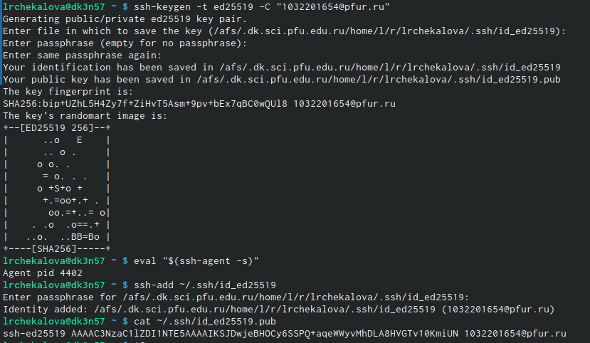
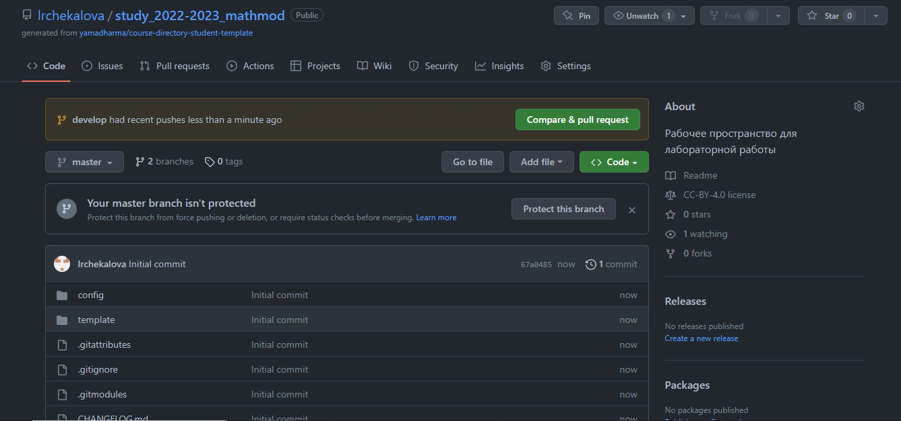
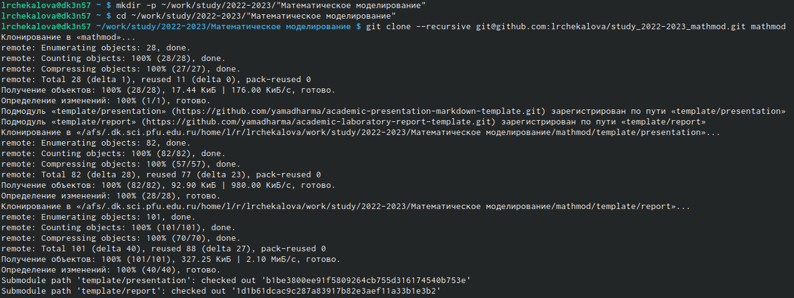
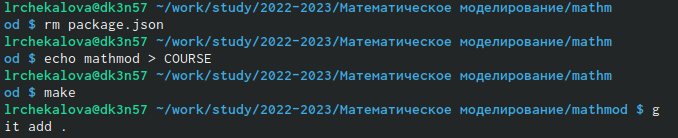
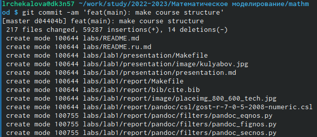
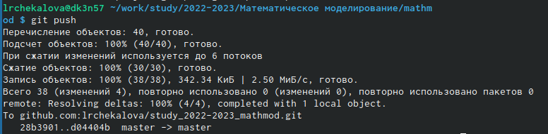
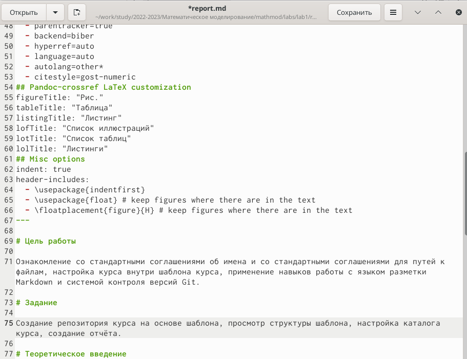
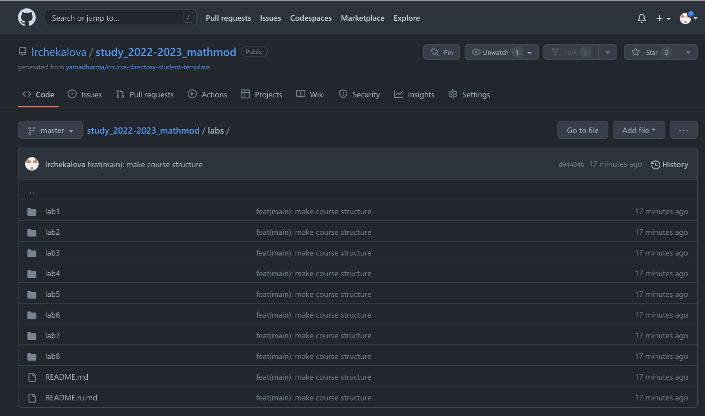

---
## Front matter
lang: ru-RU
title: Лабораторная работа №1
subtitle: Математическое моделирование
author:
  - Чекалова Л. Р.
institute:
  - Российский университет дружбы народов, Москва, Россия
date: 09 февраля 2023

## i18n babel
babel-lang: russian
babel-otherlangs: english

## Formatting pdf
toc: false
toc-title: Содержание
slide_level: 2
aspectratio: 169
section-titles: true
theme: metropolis
header-includes:
 - \metroset{progressbar=frametitle,sectionpage=progressbar,numbering=fraction}
 - '\makeatletter'
 - '\beamer@ignorenonframefalse'
 - '\makeatother'
---

## Информация о докладчике

:::::::::::::: {.columns align=center}
::: {.column width="70%"}

  * Чекалова Лилия Руслановна
  * студент 3 курса группы НФИбд-02-20
  * ст. б. 1032201654
  * Российский университет дружбы народов
  * [1032201654@pfur.ru](mailto:1032201654@@pfur.ru)

:::
::::::::::::::

# Вводная часть

## Актуальность

- Возможность совместной работы над одним проектом
- Легкость в отслеживании версий файлов
- Необходимость быстро делать отчёты
- Простота форматирования текста

## Цели и задачи

- Создать репозиторий курса на основе шаблона
- Настроить каталог курса в соответствии с заданными соглашениями
- Сделать отчёт с помощью языка разметки Markdown

## Материалы и методы

- Веб-сервис `GitHub` для работы с репозиториями
- Процессор `pandoc` для входного формата Markdown
- Результирующие форматы
	- `pdf`
	- `docx`
- Автоматизация процесса создания: `Makefile`

# Ход работы

## Подготовка к выполнению работы

- Для работы с GitHub необходимо использование SSH-ключей
- Для этого используется команда ssh-keygen и добавление ключа в ssh-agent

{width=70%}

## Создание и копирование репозитория

{width=70%}

{width=70%}

## Настройка каталога

{width=70%}

## Загрузка файлов на GitHub

{width=70%}

{width=70%}

## Создание отчета

{width=70%}

# Результаты

## Результаты работы

- Приобретены навыки работы с GitHub и Markdown
- Создан отчет в Markdown
- Создан структурированный каталог для лабораторных работ

{width=70%}

# Иногда нужно один раз сильно поработать, чтобы навсегда облегчить себе жизнь.
