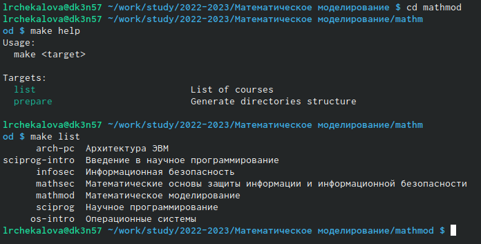

---
## Front matter
title: "Отчёт по лабораторной работе №1"
subtitle: "Математическое моделирование"
author: "Чекалова Лилия Руслановна"

## Generic otions
lang: ru-RU
toc-title: "Содержание"

## Bibliography
bibliography: bib/cite.bib
csl: pandoc/csl/gost-r-7-0-5-2008-numeric.csl

## Pdf output format
toc: true # Table of contents
toc-depth: 2
lof: true # List of figures
lot: true # List of tables
fontsize: 12pt
linestretch: 1.5
papersize: a4
documentclass: scrreprt
## I18n polyglossia
polyglossia-lang:
  name: russian
  options:
	- spelling=modern
	- babelshorthands=true
polyglossia-otherlangs:
  name: english
## I18n babel
babel-lang: russian
babel-otherlangs: english
## Fonts
mainfont: PT Serif
romanfont: PT Serif
sansfont: PT Sans
monofont: PT Mono
mainfontoptions: Ligatures=TeX
romanfontoptions: Ligatures=TeX
sansfontoptions: Ligatures=TeX,Scale=MatchLowercase
monofontoptions: Scale=MatchLowercase,Scale=0.9
## Biblatex
biblatex: true
biblio-style: "gost-numeric"
biblatexoptions:
  - parentracker=true
  - backend=biber
  - hyperref=auto
  - language=auto
  - autolang=other*
  - citestyle=gost-numeric
## Pandoc-crossref LaTeX customization
figureTitle: "Рис."
tableTitle: "Таблица"
listingTitle: "Листинг"
lofTitle: "Список иллюстраций"
lotTitle: "Список таблиц"
lolTitle: "Листинги"
## Misc options
indent: true
header-includes:
  - \usepackage{indentfirst}
  - \usepackage{float} # keep figures where there are in the text
  - \floatplacement{figure}{H} # keep figures where there are in the text
---

# Цель работы

- Ознакомление со стандартными соглашениями об имена и со стандартными соглашениями для путей к файлам
- Настройка курса внутри шаблона курса
- Применение навыков работы с языком разметки Markdown и системой контроля версий Git

# Задание

- Создание репозитория курса на основе шаблона
- Настройка каталога курса
- Создание отчёта в Markdown

# Теоретическое введение

GitHub - веб-сервис для хостинга IT-проектов и их совместной разработки, основанный на системе контроля версий Git.

Доступ к данным и их запись в репозиториях в GitHub.com с помощью SSH (протокол Secure Shell). При подключении через SSH проверка подлинности выполняется с помощью файла закрытого ключа на локальном компьютере. После создания пары ключей SSH необходимо добавить открытый ключ в GitHub.com, чтобы включить доступ по протоколу SSH для учетной записи.

С помощью протокола SSH можно подключаться и проходить проверку подлинности на удаленных серверах и службах. С помощью ключей SSH можно подключаться к GitHub без указания имени пользователя и personal access token при каждом посещении.

Markdown - облегчённый язык разметки, позволяющий форматировать в простом тексте и пригодный для машинного преобразования в языки для продвинутых публикаций.

Более подробно см. в [1-3].

# Выполнение лабораторной работы

Перед началом работы с GitHub необходимо сгенерировать ssh-ключ с помощью команды shh-keygen. Сгенерированный ключ добавляем в ssh-agent (рис. @fig:001) и затем указываем в настройках аккаунта на GitHub (рис. @fig:002).

{#fig:001 width=70%}

{#fig:002 width=70%}

Далее создаем репозиторий курса по шаблону. Выбираем пункт "use this template" > "create a new repository" (рис. @fig:003), задаем название репозитория, его описание и видимость и указываем способ создания (с копированием всех веток) (рис. @fig:004). В результате на аккаунте появляется скопированный репозиторий (рис. @fig:005).

{#fig:003 width=70%}

{#fig:004 width=70%}

{#fig:005 width=70%}

Следующим шагом на компьютере создаём необходимые папки с помощью команды mkdir и командой git clone производим копирование репозитория с сервера на компьютер (рис. @fig:006).

{#fig:006 width=70%}

Перейдя в папку репозитория mathmod, смотрим доступные цели для make и список доступных курсов с помощью команд make help и make list (рис. @fig:007).

{#fig:007 width=70%}

Удаляем ненужные файлы командой rm и создаём необходимые каталоги по шаблону. Для этого в файл COURSE записываем код курса командой echo и производим сборку каталога по шаблону командой make (рис. @fig:008).

{#fig:008 width=70%}

Отправляем файлы на сервер с помощью команд git add, git commit (рис. @fig:009) и git push (рис. @fig:010). На сайте отображается измененный репозиторий (рис. @fig:011).

{#fig:009 width=70%}

{#fig:010 width=70%}

{#fig:011 width=70%}

В заключительном этапе работы создаём отчет, редактируя файл report.md (рис. @fig:012).

{#fig:012 width=70%}

# Выводы

В ходе работы были отточены навыки пользования системой контроля версий Git и языком разметки Markdown, а также приобретены знания стандартных соглашений об именах и стандартных соглашений для путей к файлам. Результатом работы стало структурированное рабочее пространство, созданное в соответствии с указанными выше соглашениями.

# Список литературы

1. Сведения об SSH: https://docs.github.com/ru/authentication/connecting-to-github-with-ssh/about-ssh
2. Wikipedia: GitHub: https://ru.wikipedia.org/wiki/GitHub
3. Wikipedia: Markdown: https://ru.wikipedia.org/wiki/Markdown
4. Теоретические материалы к лабораторной работе "Работа с Git": https://esystem.rudn.ru/pluginfile.php/1971643/mod_folder/content/0/git.pdf
5. Теоретические материалы к лабораторной работе "Работа с Markdown": https://esystem.rudn.ru/pluginfile.php/1971643/mod_folder/content/0/markdown.pdf