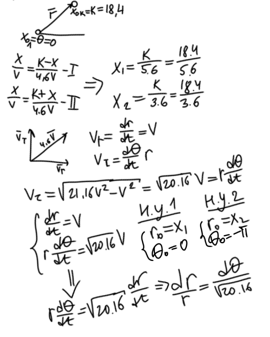
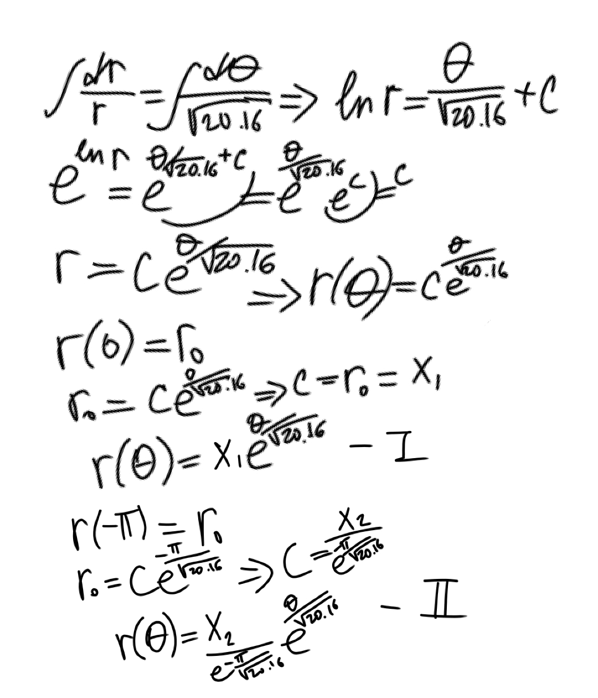
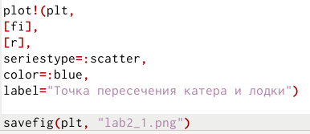
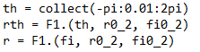
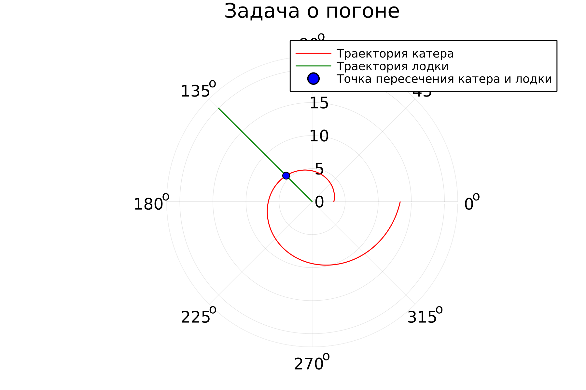
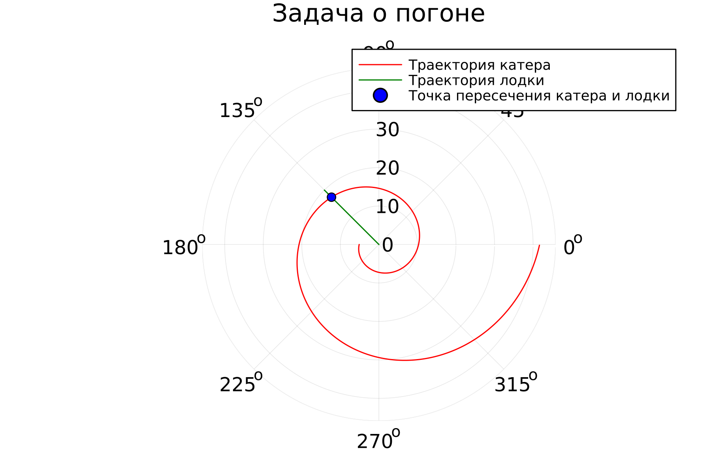
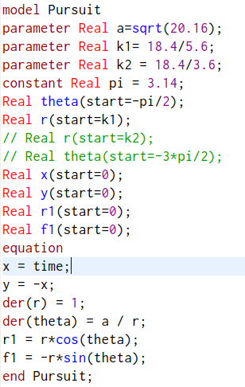
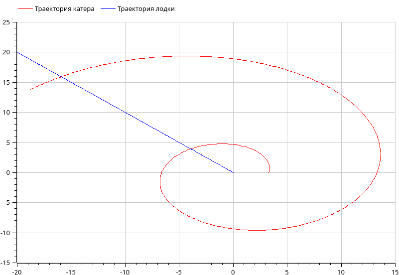
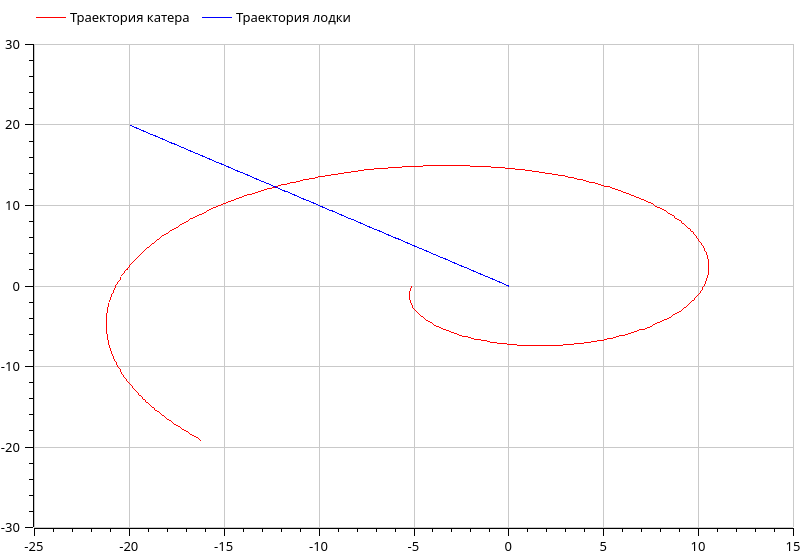

---
## Front matter
lang: ru-RU
title: Лабораторная работа №2
subtitle: Математическое моделирование
author:
  - Чекалова Л. Р.
institute:
  - Российский университет дружбы народов, Москва, Россия
date: 17 февраля 2023

## i18n babel
babel-lang: russian
babel-otherlangs: english

## Formatting pdf
toc: false
toc-title: Содержание
slide_level: 2
aspectratio: 169
section-titles: true
theme: metropolis
header-includes:
 - \metroset{progressbar=frametitle,sectionpage=progressbar,numbering=fraction}
 - '\makeatletter'
 - '\beamer@ignorenonframefalse'
 - '\makeatother'
---

## Информация о докладчике

:::::::::::::: {.columns align=center}
::: {.column width="70%"}

  * Чекалова Лилия Руслановна
  * студент 3 курса группы НФИбд-02-20
  * ст. б. 1032201654
  * Российский университет дружбы народов
  * [1032201654@pfur.ru](mailto:1032201654@@pfur.ru)

:::
::::::::::::::

# Вводная часть

## Актуальность

- Необходимость решения задач поиска
- Необходимость визуализировать данные
- Простота построения моделей

## Цели и задачи

- Решить задачу о погоне с помощью дифференциальных уравнений
- Построить математическую модель задачи
- Визуализировать модель с помощью Julia и OpenModelica
- Проанализировать полученные результаты

## Материалы и методы

- Средства языка `Julia` для визуализации данных
- GUI `OMEdit` для визуализации данных на `OpenModelica`
- Результирующие форматы
	- `jl`
	- `mo`
	- `png`

# Ход работы

## Подготовка к выполнению работы

Проведя ряд рассуждений, получаем дифференциальное уравнение.

{height=80%}

## Решение дифференциального уравнения

{height=90%}

## Программа на языке Julia, 1

{height=90%}

## Программа на языке Julia, 2

{width=70%}

{width=70%}

## График на языке Julia, 1 случай

{width=70%}

## График на языке Julia, 2 случай

{width=70%}

## Программа на языке OpenModelica

{height=90%}

## График на языке OpenModelica, 1 случай

{width=70%}

## График на языке OpenModelica, 2 случай

{width=70%}

# Результаты

## Сравнение языков

- Julia
  - более интуитивно понятный язык
  - позволяет производить различные вычисления, не ограничиваясь работой с визуализацией уравнений
- OpenModelica
  - более узконаправленный инструмент
  - ориентируется на создание сложных моделей с множеством уравнений в основе
  - работа с ним кажется труднее

## Результаты работы

- Приобретены навыки работы с Julia и OpenModelica
- Построена математическая модель задачи о погоне
- Построены графики, визуализирующие решение задачи

# Если долго мучиться, что-нибудь получится. © А. Пугачева