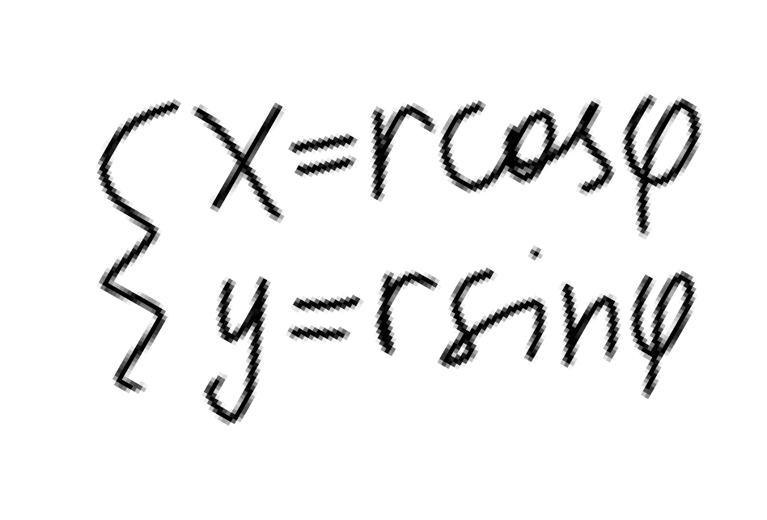

по---
## Front matter
title: "Отчёт по лабораторной работе №2"
subtitle: "Математическое моделирование"
author: "Чекалова Лилия Руслановна"

## Generic otions
lang: ru-RU
toc-title: "Содержание"

## Bibliography
bibliography: bib/cite.bib
csl: pandoc/csl/gost-r-7-0-5-2008-numeric.csl

## Pdf output format
toc: true # Table of contents
toc-depth: 2
lof: true # List of figures
lot: true # List of tables
fontsize: 12pt
linestretch: 1.5
papersize: a4
documentclass: scrreprt
## I18n polyglossia
polyglossia-lang:
  name: russian
  options:
	- spelling=modern
	- babelshorthands=true
polyglossia-otherlangs:
  name: english
## I18n babel
babel-lang: russian
babel-otherlangs: english
## Fonts
mainfont: PT Serif
romanfont: PT Serif
sansfont: PT Sans
monofont: PT Mono
mainfontoptions: Ligatures=TeX
romanfontoptions: Ligatures=TeX
sansfontoptions: Ligatures=TeX,Scale=MatchLowercase
monofontoptions: Scale=MatchLowercase,Scale=0.9
## Biblatex
biblatex: true
biblio-style: "gost-numeric"
biblatexoptions:
  - parentracker=true
  - backend=biber
  - hyperref=auto
  - language=auto
  - autolang=other*
  - citestyle=gost-numeric
## Pandoc-crossref LaTeX customization
figureTitle: "Рис."
tableTitle: "Таблица"
listingTitle: "Листинг"
lofTitle: "Список иллюстраций"
lotTitle: "Список таблиц"
lolTitle: "Листинги"
## Misc options
indent: true
header-includes:
  - \usepackage{indentfirst}
  - \usepackage{float} # keep figures where there are in the text
  - \floatplacement{figure}{H} # keep figures where there are in the text
---

# Цель работы

- Построение математической модели для выбора правильной стратегии при решении задач поиска, в частности, задачи о погоне
- Визуализация полученной модели с помощью средств языков Julia и OpenModelica

# Задание

- Провести вывод дифференциальных уравнений в соответствии с заданными условиями
- Построить траекторию движения катера и лодки для двух случаев
- Определить по графику точку пересечения катера и лодки

# Теоретическое введение

Будем рассматривать задачу следующего содержания: На море в тумане катер береговой охраны преследует лодку браконьеров. Через определенный промежуток времени туман рассеивается, и лодка обнаруживается на расстоянии k км от катера. Затем лодка снова скрывается в тумане и уходит прямолинейно в неизвестном направлении. Известно, что скорость катера в n раза больше скорости браконьерской лодки. Необходимо определить по какой траектории необходимо двигаться катеру, чтобы нагнать лодку.

В варианте 65 k=18.4, n=4.6.

Полагаем t~0~ = 0, x~л0~ = 0 - место нахождения лодки браконьеров в момент обнаружения, x~к0~ = k - место нахождения катера береговой охраны 
относительно лодки браконьеров в момент обнаружения лодки.

Вводим полярные координаты. Считаем, что полюс - это точка обнаружения лодки браконьеров x~л0~ (theta = x~л0~ = 0), а полярная ось r проходит через точку нахождения катера береговой охраны.

Траектория катера должна быть такой, чтобы и катер, и лодка все время были на одном расстоянии от полюса theta, только в этом случае траектория катера пересечется с траекторией лодки. Поэтому для начала катер береговой охраны должен двигаться некоторое время прямолинейно, пока не окажется на том же расстоянии от полюса, что и лодка браконьеров. После этого катер береговой охраны должен двигаться вокруг полюса удаляясь от него с той же скоростью, что и лодка браконьеров.

Чтобы найти расстояние x (расстояние после которого катер начнет двигаться вокруг полюса), необходимо составить простое уравнение. Пусть через время t катер и лодка окажутся на одном расстоянии x от полюса. За это время лодка пройдет x, а катер k-x (или k+x, в зависимости от начального положения катера относительно полюса). Время, за которое они пройдут это расстояние, вычисляется как x/v или (k-x)/(nv) (во втором случае (k+x)/(nv)). Так как время одно и то же, то эти величины одинаковы. Тогда неизвестное расстояние x можно найти из следующего уравнения:

x/v = (k-x)/(nv) в первом случае или x/v = (k+x)/(nv) во втором. Отсюда находим x~1~ и x~2~.

После того, как катер береговой охраны окажется на одном расстоянии от полюса, что и лодка, он должен сменить прямолинейную траекторию и начать двигаться вокруг полюса удаляясь от него со скоростью лодки v. Для этого скорость катера раскладываем на две составляющие: v~r~ - радиальная скорость и v~t~ - тангенциальная скорость. Радиальная скорость - это скорость, с которой катер удаляется от полюса, v~r~ = dr/dt = v, так как нам нужно, чтобы эта скорость была равна скорости лодки.

Тангенциальная скорость – это линейная скорость вращения катера относительно полюса, v~t~ = r(dtheta/dt).

Мы вычисляем тангенциальную скорость, получаем систему дифференциальных уравнений с начальными условиями и в результате преобразований получаем уравнение (рис. @fig:001). Решив это уравнение мы получим траекторию движения катера в полярных координатах.

{#fig:001 width=70%}

Более подробно см. в [1].

# Выполнение лабораторной работы

Решаем выведенное нами ранее дифференциальное уравнение с разделяющими переменными и подставляем начальные условия, чтобы вычислить константу для каждого случая (рис. @fig:002).

{#fig:002 width=70%}

Используя библиотеку Plots, пишем программу на Julia (рис. @fig:003).

{#fig:003 width=70%}

В начале программы указываем начальные условия, затем описываем функцией решенное нами уравнение и передаем в нее данные для построения графика. Для нахождения точки пересечения пользуемся формулами перевода из полярной системы координат в декартовую (рис. @fig:004).

{#fig:004 width=70%}

Рисуем графики, находим точку пересечения и сохраняем полученное изображение в файл (рис. @fig:005).

{#fig:005 width=70%}

Исследовав график (рис. @fig:006), получаем, что для первого случая координаты точки пересечения равны (-3.9, 3.9).

{#fig:006 width=70%}

Для второго случая меняем входные данные для нашей функции, описывающей уравнение (рис. @fig:007).

{#fig:007 width=70%}

Рассмотрев график для второго случая (рис. @fig:008), получаем координаты точки пересечения, равные (-12.3, 12.3).

{#fig:008 width=70%}

Далее создаем модель на OpenModelica (рис. @fig:009). Задаем необходимые начальные условия в виде параметров, а нужные нам уравнения указываем в разделе equation, в том числе уравнения перевода из полярной системы координат в декартовую.

{#fig:009 width=70%}

Настраиваем параметры симуляции, указываем начальное, конечное время и число интервалов (рис. @fig:010) и формат вывода (рис. @fig:011).

{#fig:010 width=70%}

{#fig:011 width=70%}

Выбираем график типа Parametric Plot и указываем необходимые нам оси, линии графика, настраиваем легенду (рис. @fig:012).

{#fig:012 width=70%}

Рассмотрев первый график (рис. @fig:013), получаем координаты точки пересечения, равные (-3.9, 3.9).

{#fig:013 width=70%}

Проанализировав второй график (рис. @fig:014), видим, что координаты точки пересечение равны (-12.3, 12.3).

{#fig:014 width=70%}

# Сравнение языков

Julia является более интуитивно понятным языком и позволяет производить различные вычисления, не ограничиваясь рамками работы с визуализацией уравнений.

OpenModelica является более узконаправленным инструментом, ориентирующимся на создание сложных моделей с множеством уравнений в основе. Из-за этого работа с ним кажется труднее.

На результаты работы различия в подходах этих языков практически не повлияли, координаты точек пересечения в разных реализациях совпадают с точностью до одного знака после запятой.

# Выводы

В ходе работы были получены навыки построения математических моделей для решения задачи о погоне и визуализации их с помощью языков Julia и OpenModelica, а также закреплены знания, связанные с решением дифференциальных уравнений. Результатом работы стали графики, наглядно демонстрирующие решение задачи о погоне.

# Список литературы

1. Теоретические материалы к лабораторной работе "Задача о погоне": https://esystem.rudn.ru/mod/resource/view.php?id=967233