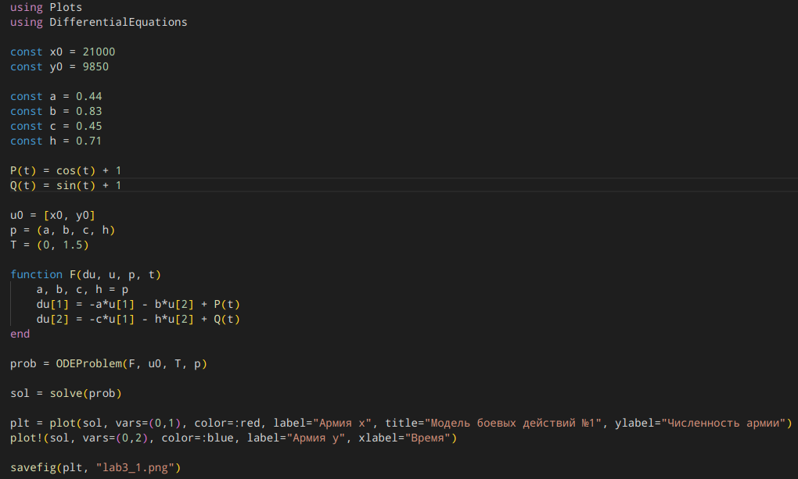
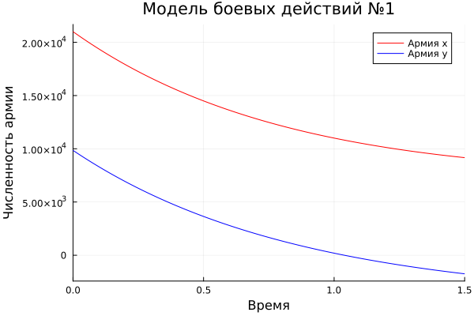
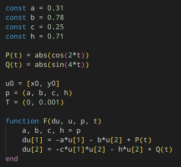
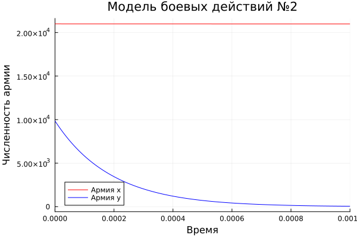
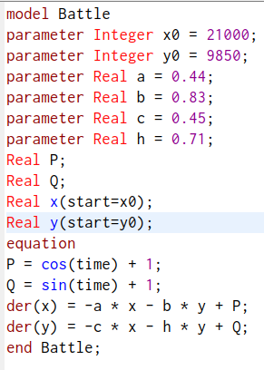
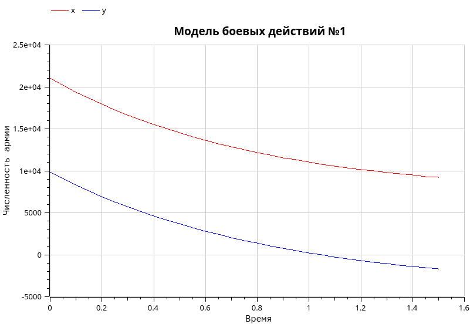
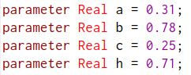
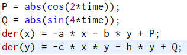
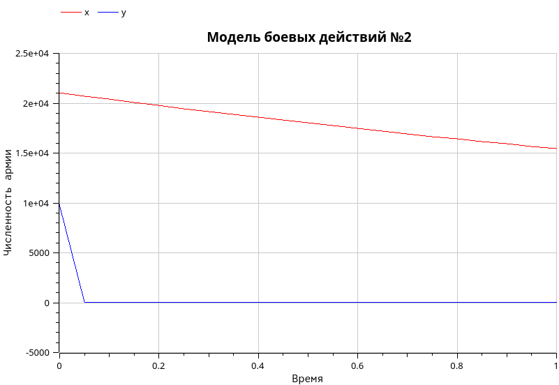

---
## Front matter
lang: ru-RU
title: Лабораторная работа №3
subtitle: Математическое моделирование
author:
  - Чекалова Л. Р.
institute:
  - Российский университет дружбы народов, Москва, Россия
date: 21 февраля 2023

## i18n babel
babel-lang: russian
babel-otherlangs: english

## Formatting pdf
toc: false
toc-title: Содержание
slide_level: 2
aspectratio: 169
section-titles: true
theme: metropolis
header-includes:
 - \metroset{progressbar=frametitle,sectionpage=progressbar,numbering=fraction}
 - '\makeatletter'
 - '\beamer@ignorenonframefalse'
 - '\makeatother'
---

# Информация

## Докладчик

:::::::::::::: {.columns align=center}
::: {.column width="70%"}

  * Чекалова Лилия Руслановна
  * студент 3 курса группы НФИбд-02-20
  * ст. б. 1032201654
  * Российский университет дружбы народов
  * [1032201654@pfur.ru](mailto:1032201654@@pfur.ru)

:::
::::::::::::::

# Вводная часть

## Актуальность

- Необходимость предоставления командованию оснований для принятия решений
- Необходимость визуализировать данные
- Простота построения моделей

## Цели и задачи

- Построить математическую модель боевых действий
- Визуализировать модель с помощью Julia и OpenModelica
- Проанализировать полученные результаты

## Материалы и методы

- Средства языка `Julia` для визуализации данных
- GUI `OMEdit` для визуализации данных на `OpenModelica`
- Результирующие форматы
	- `jl`
	- `mo`
	- `png`

# Ход работы

## Построение модели для двух случаев

Модель для первого случая: $\begin{cases}\frac{\text{d}x}{\text{d}t} = -a(t)x(t)-b(t)y(t)+P(t)\\\frac{\text{d}y}{\text{d}t} = -c(t)x(t)-h(t)y(t)+Q(t)\end{cases}$

Модель для второго случая: $\begin{cases}\frac{\text{d}x}{\text{d}t} = -a(t)x(t)-b(t)y(t)+P(t)\\\frac{\text{d}y}{\text{d}t} = -c(t)x(t)y(t)-h(t)y(t)+Q(t)\end{cases}$

## Программа на языке Julia, 1

{height=90% width=70%}

## График на языке Julia, 1

{height=90% width=70%}

## Программа на языке Julia, 2

{height=90% width=70%}

## График на языке Julia, 2

{height=90% width=70%}

## Программа на языке OpenModelica, 1

{height=90% width=70%}

## График на языке OpenModelica, 1

{height=90% width=70%}

## Программа на языке OpenModelica, 2

{width=70%}

{width=70%}

## График на языке OpenModelica, 2

{height=90% width=70%}

# Результаты

## Результаты работы

- Приобретены навыки работы с Julia и OpenModelica
- Построена математическая модель боевых действий
- Построены графики, визуализирующие решение задачи
- OpenModelica --- более подходящий язык для работы с данной моделью