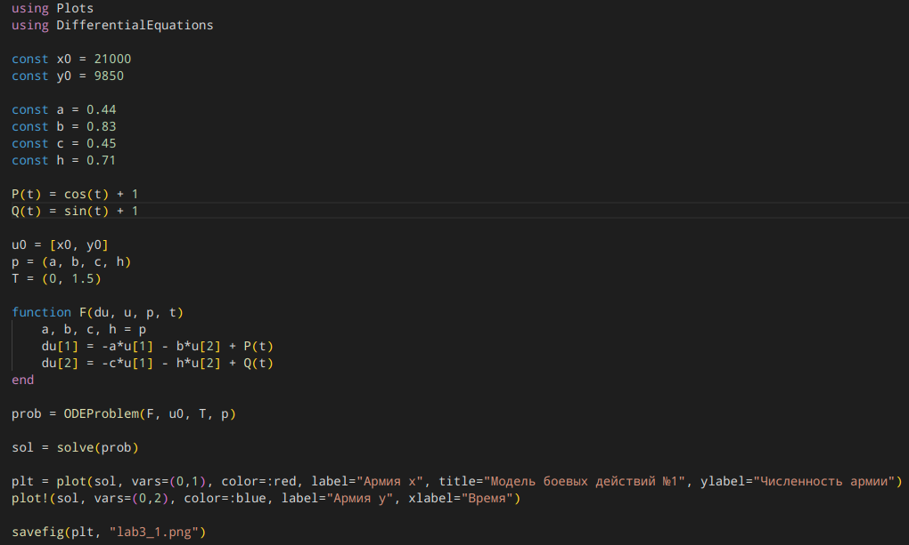
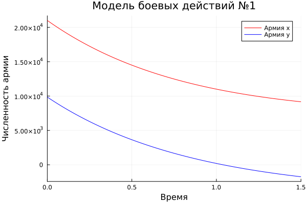
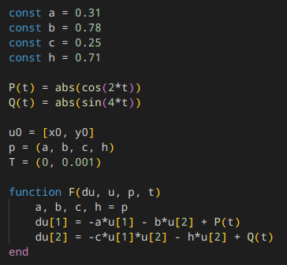
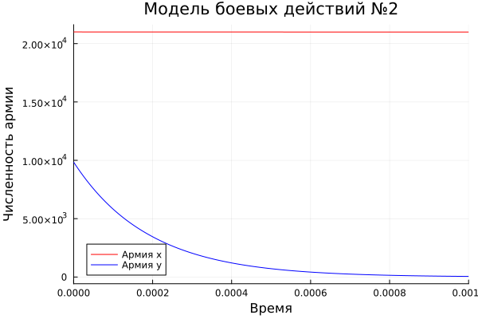
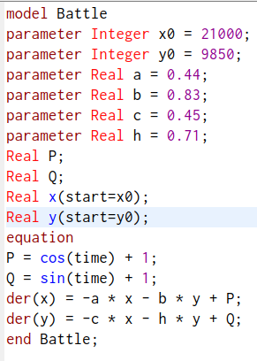
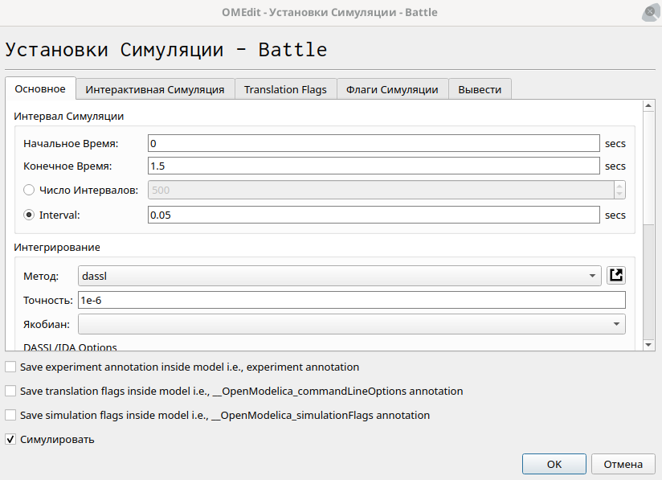
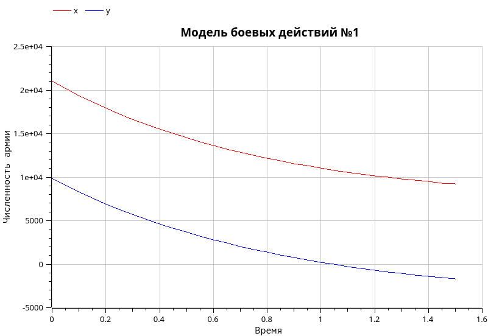
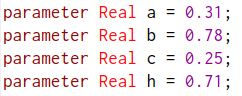
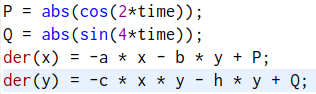
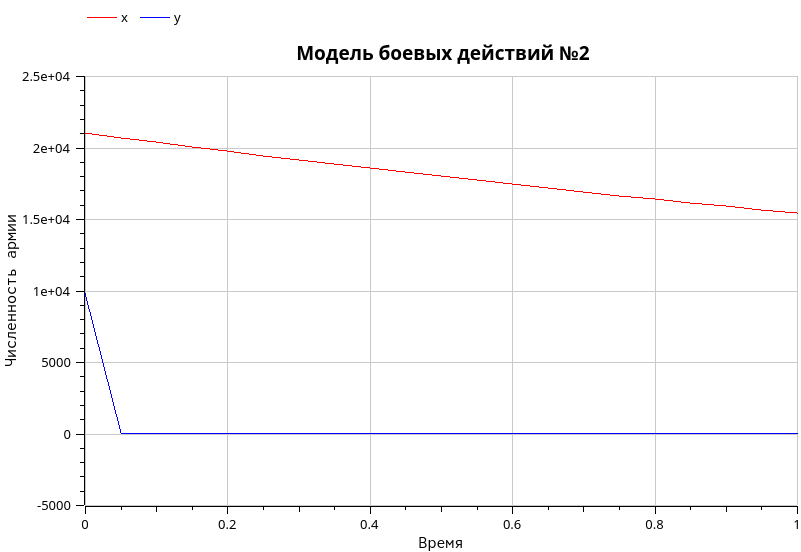

---
## Front matter
title: "Лабораторная работа №3"
subtitle: "Математическое моделирование"
author: "Лилия Руслановна Чекалова"

## Generic otions
lang: ru-RU
toc-title: "Содержание"

## Bibliography
bibliography: bib/cite.bib
csl: pandoc/csl/gost-r-7-0-5-2008-numeric.csl

## Pdf output format
toc: true # Table of contents
toc-depth: 2
lof: true # List of figures
lot: true # List of tables
fontsize: 12pt
linestretch: 1.5
papersize: a4
documentclass: scrreprt
## I18n polyglossia
polyglossia-lang:
  name: russian
  options:
	- spelling=modern
	- babelshorthands=true
polyglossia-otherlangs:
  name: english
## I18n babel
babel-lang: russian
babel-otherlangs: english
## Fonts
mainfont: PT Serif
romanfont: PT Serif
sansfont: PT Sans
monofont: PT Mono
mainfontoptions: Ligatures=TeX
romanfontoptions: Ligatures=TeX
sansfontoptions: Ligatures=TeX,Scale=MatchLowercase
monofontoptions: Scale=MatchLowercase,Scale=0.9
## Biblatex
biblatex: true
biblio-style: "gost-numeric"
biblatexoptions:
  - parentracker=true
  - backend=biber
  - hyperref=auto
  - language=auto
  - autolang=other*
  - citestyle=gost-numeric
## Pandoc-crossref LaTeX customization
figureTitle: "Рис."
tableTitle: "Таблица"
listingTitle: "Листинг"
lofTitle: "Список иллюстраций"
lotTitle: "Список таблиц"
lolTitle: "Листинги"
## Misc options
indent: true
header-includes:
  - \usepackage{indentfirst}
  - \usepackage{float} # keep figures where there are in the text
  - \floatplacement{figure}{H} # keep figures where there are in the text
---

# Цель работы

- Построение простейшей математической модели боевых действий --- модели Ланчестера
- Визуализация модели на языках Julia и OpenModelica
- Сравнение языков Julia и OpenModelica

# Задание

- Построить график изменения численности войск армии X и армии Y на основе модели боевых действий между регулярными войсками
- Построить график изменения численности войск армии X и армии Y на основе модели боевых действий с участием регулярных войск и партизанских отрядов
- Проанализировать графики

# Теоретическое введение

Модель Ланчестера является простейшей моделью для описания боевых действий. Основной характеристикой соперников являются численности сторон (если какая-то из численностей обращается в ноль при положительной численности соперника, то данная сторона считается проигравшей).

Существует три случая ведения боевых действий:

- Боевые действия между регулярными войсками
- Боевые действия с участием регулярных войск и партизанских отрядов
- Боевые действия между партизанскими отрядами

В рамках нашей задачи мы будем рассматривать только первые два случая. Для описания этих случаев будут использоваться общие обозначения:

- a(t) и h(t) --- коэффициенты, описывающие потери, не связанные с боевыми действиями (болезнь, дезертирство и пр.)
- b(t) и c(t) --- коэффициенты, отражающие потери на поле боя
- P(t) и Q(t) --- функции, учитывающие возможность подхода подкрепления к войскам

В первом случае (бой между регулярными войсками) модель имеет вид: $$\begin{cases}\frac{\text{d}x}{\text{d}t} = -a(t)x(t)-b(t)y(t)+P(t)\\\frac{\text{d}y}{\text{d}t} = -c(t)x(t)-h(t)y(t)+Q(t)\end{cases}$$

Во втором случае в борьбу добавляются партизанские отряды. Нерегулярные войска в отличии от постоянной армии менее уязвимы, так как действуют скрытно, в этом случае сопернику приходится действовать неизбирательно, по площадям, занимаемым партизанами. Поэтому считается, что темп потерь партизан, проводящих свои операции в разных местах на некоторой известной территории, пропорционален не только численности армейских соединений, но и численности самих партизан. В результате модель принимает вид: $$\begin{cases}\frac{\text{d}x}{\text{d}t} = -a(t)x(t)-b(t)y(t)+P(t)\\\frac{\text{d}y}{\text{d}t} = -c(t)x(t)y(t)-h(t)y(t)+Q(t)\end{cases}$$ 

Более подробно о модели боевых действий см. в [@theory-lab;@about-model].

# Выполнение лабораторной работы

Построив модель для случая боевых действий между регулярными войсками, пишем программу на языке Julia (рис. @fig:001). Указываем начальные значения и коэффициенты, задаем функции возможности подхода подкрепления и функцию, описывающую нашу модель. С помощью библиотеки DifferentialEquations находим решение системы [@ode-solve] и визуализируем его средствами библиотеки Plots.

{#fig:001 width=70%}

Из полученного графика можно сделать вывод, что армия Y в заданных условиях является проигравшей стороной, так как численность ее армии доходит до нуля (рис. @fig:002).

{#fig:002 width=70%}

Меняем значения коэффициентов и функций P(t) и Q(t), а также слегка меняем функцию, описывающую нашу модель, чтобы она соответствовала второму случаю (рис. @fig:003).

{#fig:003 width=70%}

Из графика видно, что армия Y стремительно теряет в численности при указанных условиях и опять проигрывает (рис. @fig:004).

{#fig:004 width=70%}

Далее описываем модель для первого случая на OpenModelica (рис. @fig:005). В параметрах указываем начальные значения и коэффициенты, в разделе equation задаем функции, описывающие модель.

{#fig:005 width=70%}

В установке симуляции настроим начальное и конечное время, а также размер интервала (рис. @fig:006).

{#fig:006 width=70%}

Полученный график демонстрирует, что армия Y находится на проигрывающей позиции (рис. @fig:007).

{#fig:007 width=70%}

Для второго случая меняем значения параметров-коэффициентов (рис. @fig:008) и функции, задающие модель (рис. @fig:009).

{#fig:008 width=70%}

{#fig:009 width=70%}

График показывает, что проигрывающей стороной является армия Y, чья численность значительно упала в короткие сроки (рис. @fig:010).

{#fig:010 width=70%}

# Выводы

В ходе работы была освоена простейшая модель боевых действий --- модель Ланчестера, и были применены навыки работы с Julia и OpenModelica для визуализации модели с помощью графиков. Результатом работы стали графики, демонстрирующие изменение численности двух армий на основе двух случаев ведения боевых действий, которые позволили нам сделать выводы о том, какая сторона считается проигравшей.

Сравнивая Julia и OpenModelica, отмечу, что, на мой взгляд, OpenModelica больше подходит для решения данной задачи, так как она специализируется на работе с дифференциальными уравнениями, в то время как Julia требует применения дополнительных библиотек. 

# Список литературы{.unnumbered}

::: {#refs}
:::
