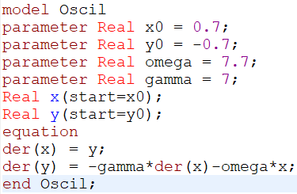

---
## Front matter
lang: ru-RU
title: Лабораторная работа №4
subtitle: Математическое моделирование
author:
  - Чекалова Л. Р.
institute:
  - Российский университет дружбы народов, Москва, Россия
date: 28 февраля 2023

## i18n babel
babel-lang: russian
babel-otherlangs: english

## Formatting pdf
toc: false
toc-title: Содержание
slide_level: 2
aspectratio: 169
section-titles: true
theme: metropolis
header-includes:
 - \metroset{progressbar=frametitle,sectionpage=progressbar,numbering=fraction}
 - '\makeatletter'
 - '\beamer@ignorenonframefalse'
 - '\makeatother'
---

# Информация

## Докладчик

:::::::::::::: {.columns align=center}
::: {.column width="70%"}

  * Чекалова Лилия Руслановна
  * студент 3 курса группы НФИбд-02-20
  * ст. б. 1032201654
  * Российский университет дружбы народов
  * [1032201654@pfur.ru](mailto:1032201654@@pfur.ru)

:::
::::::::::::::

# Вводная часть

## Актуальность

- Универсальность модели гармонического осциллятора
- Необходимость визуализировать данные
- Простота построения моделей

## Цели и задачи

- Построить фазовый портрет и решение уравнения гармонического осциллятора с помощью Julia и OpenModelica
- Проанализировать полученные результаты

## Материалы и методы

- Средства языка `Julia` для визуализации данных
- GUI `OMEdit` для визуализации данных на `OpenModelica`
- Результирующие форматы
	- `jl`
	- `mo`
	- `png`

# Ход работы

## Три случая колебаний гармонического осциллятора

Модель для первого случая: $\begin{cases}\dot{x} = y\\\dot{y} = -\omega_{0}^{2}x\end{cases}$

Модель для второго случая: $\begin{cases}\dot{x} = y\\\dot{y} = -2\gamma\dot{x}-\omega_{0}^{2}x\end{cases}$

Модель для третьего случая: $\begin{cases}\dot{x} = y\\\dot{y} = P(t)-2\gamma\dot{x}-\omega_{0}^{2}x\end{cases}$

## Программа на языке Julia, 1

{height=90% width=70%}

## Фазовый портрет на языке Julia, 1

{height=90% width=70%}

## Решение уравнения на языке Julia, 1

{height=90% width=70%}

## Программа на языке Julia, 2

{height=90% width=70%}

## Фазовый портрет на языке Julia, 2

{height=90% width=70%}

## Решение уравнения на языке Julia, 2

{height=90% width=70%}

## Программа на языке Julia, 3

{height=90% width=70%}

## Фазовый портрет на языке Julia, 3

{height=90% width=70%}

## Решение уравнения на языке Julia, 3

{height=90% width=70%}

## Программа на языке OpenModelica, 1

{height=90% width=70%}

## Фазовый портрет на языке OpenModelica, 1

{height=90% width=70%}

## Решение уравнения на языке OpenModelica, 1

{height=90% width=70%}

## Программа на языке OpenModelica, 2

{height=90% width=70%}

## Фазовый портрет на языке OpenModelica, 2

{height=90% width=70%}

## Решение уравнения на языке OpenModelica, 2

{height=90% width=70%}

## Программа на языке OpenModelica, 3

{height=90% width=70%}

## Фазовый портрет на языке OpenModelica, 3

{height=90% width=70%}

## Решение уравнения на языке OpenModelica, 3

{height=90% width=70%}

# Результаты

## Результаты работы

- Приобретены навыки работы с Julia и OpenModelica
- Построена модель колебаний гармонического осциллятора
- Построены графики фазового портрета и решения уравнения гармонического осциллятора
- OpenModelica --- более подходящий язык для работы с данной моделью