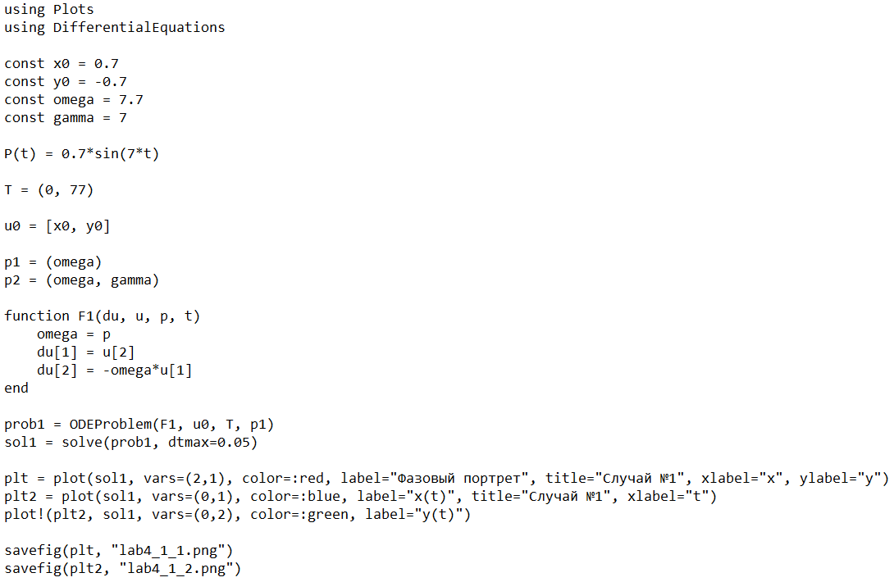
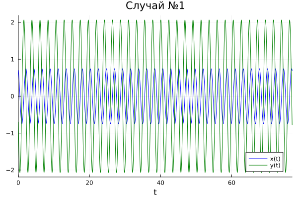
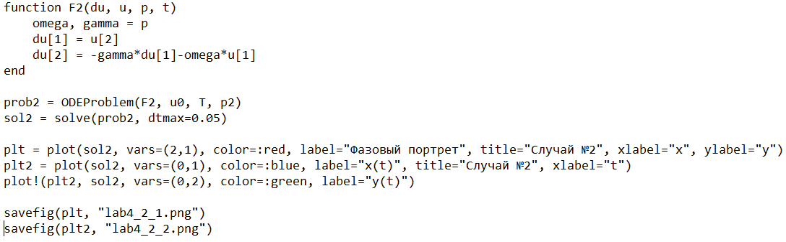
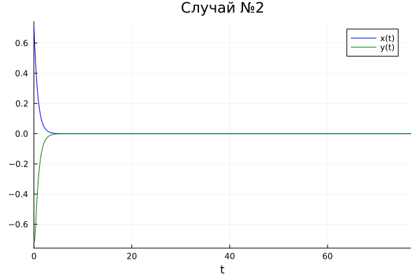
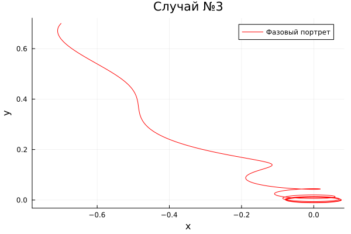
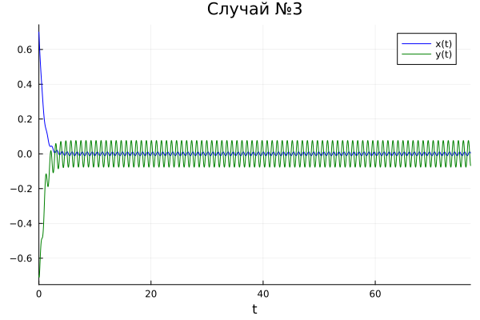
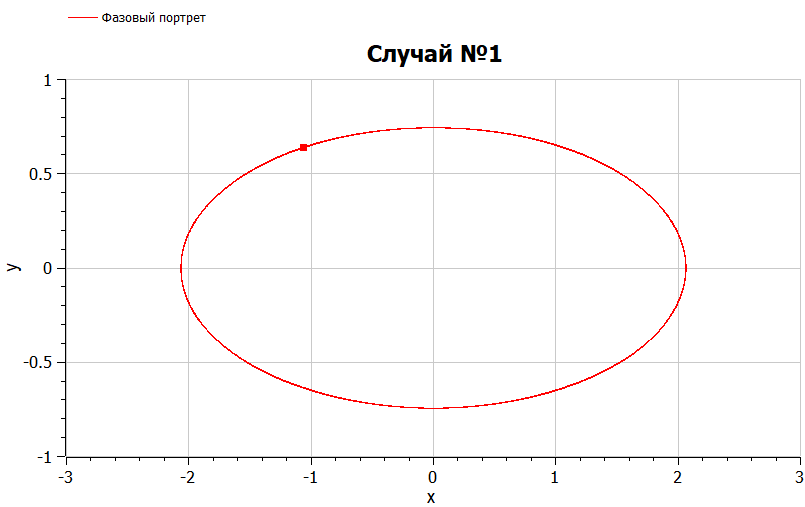
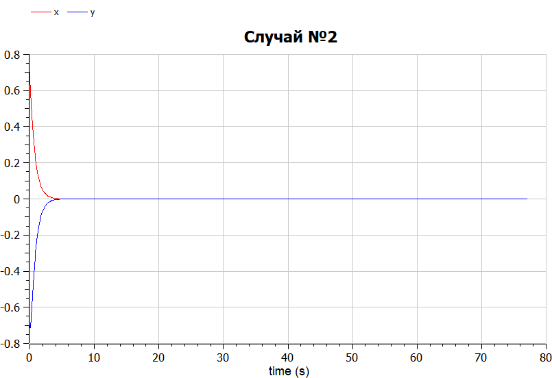
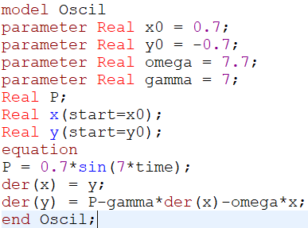
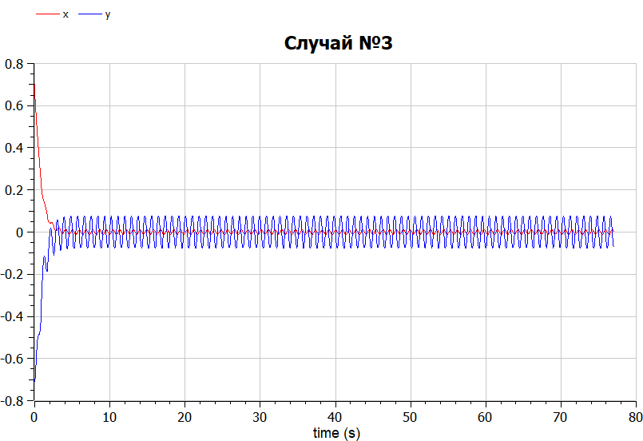

---
## Front matter
title: "Лабораторная работа №4"
subtitle: "Математическое моделирование"
author: "Чекалова Лилия Руслановна"

## Generic otions
lang: ru-RU
toc-title: "Содержание"

## Bibliography
bibliography: bib/cite.bib
csl: pandoc/csl/gost-r-7-0-5-2008-numeric.csl

## Pdf output format
toc: true # Table of contents
toc-depth: 2
lof: true # List of figures
lot: true # List of tables
fontsize: 12pt
linestretch: 1.5
papersize: a4
documentclass: scrreprt
## I18n polyglossia
polyglossia-lang:
  name: russian
  options:
	- spelling=modern
	- babelshorthands=true
polyglossia-otherlangs:
  name: english
## I18n babel
babel-lang: russian
babel-otherlangs: english
## Fonts
mainfont: PT Serif
romanfont: PT Serif
sansfont: PT Sans
monofont: PT Mono
mainfontoptions: Ligatures=TeX
romanfontoptions: Ligatures=TeX
sansfontoptions: Ligatures=TeX,Scale=MatchLowercase
monofontoptions: Scale=MatchLowercase,Scale=0.9
## Biblatex
biblatex: true
biblio-style: "gost-numeric"
biblatexoptions:
  - parentracker=true
  - backend=biber
  - hyperref=auto
  - language=auto
  - autolang=other*
  - citestyle=gost-numeric
## Pandoc-crossref LaTeX customization
figureTitle: "Рис."
tableTitle: "Таблица"
listingTitle: "Листинг"
lofTitle: "Список иллюстраций"
lotTitle: "Список таблиц"
lolTitle: "Листинги"
## Misc options
indent: true
header-includes:
  - \usepackage{indentfirst}
  - \usepackage{float} # keep figures where there are in the text
  - \floatplacement{figure}{H} # keep figures where there are in the text
---

# Цель работы

- Построение математической модели колебаний гармонического осциллятора
- Визуализация модели на языках Julia и OpenModelica

# Задание

- Построить фазовый портрет и решение уравнения гармонического осциллятора при колебаниях гармонического осциллятора без затуханий и без действий внешней силы
- Построить фазовый портрет и решение уравнения гармонического осциллятора при колебаниях гармонического осциллятора с затуханием и без действий внешней силы
- Построить фазовый портрет и решение уравнения гармонического осциллятора при колебаниях гармонического осциллятора с затуханием и под действием внешней силы

# Теоретическое введение

Движение грузика на пружинке, маятника, заряда в электрическом контуре, а также эволюция во времени многих систем в физике, химии, биологии и других науках при определенных предположениях можно описать одним и тем же дифференциальным уравнением, которое в теории колебаний выступает в качестве основной модели. Эта модель называется линейным гармоническим осциллятором.

Уравнение свободных колебаний гармонического осциллятора имеет следующий вид: $$\ddot{x} + 2\gamma\dot{x} + \omega_{0}^{2}x = 0$$, где $x$ --- переменная, описывающая состояние системы (например, смещение грузика), $\gamma$ --- параметр, характеризующий потери энергии (например, трение в механической системе), $\omega_{0}$ --- собственная частота колебаний.

Зададим начальные условия: $\begin{cases}x(t_{0}) = x_{0}\\dot{x}(t_{0}) = y_{0}\end{cases}$.

Для первого случая потери в системе отсутствуют ($\gamma = 0$), поэтому уравнение принимает вид: $\ddot{x} + \omega_{0}^{2}x = 0$. Представим его в виде системы: $\begin{cases}\dot{x} = y\\\dot{y} = -\omega_{0}^{2}x\end{cases}$.

Для второго случая появляются потери в системе, и система уравнений принимает вид: $\begin{cases}\dot{x} = y\\\dot{y} = -2\gamma\dot{x}-\omega_{0}^{2}x\end{cases}$.

Для третьего случая помимо потерь на систему влияет внешняя сила, описываемая функцией $P(t)$. Тогда система уравнений примет вид: $\begin{cases}\dot{x} = y\\\dot{y} = P(t)-2\gamma\dot{x}-\omega_{0}^{2}x\end{cases}$.

Для всех этих систем начальные условия примут вид: $\begin{cases}x(t_{0}) = x_{0}\\y(t_{0}) = y_{0}\end{cases}$

Более подробно см. в [@lab-theory].

# Выполнение лабораторной работы

По полученому уравнению для первого случая пишем программу на Julia (рис. @fig:001).

{#fig:001 width=70%}

Получаем графики решения уравнения (рис. @fig:002) и фазовый портрет гармонического осциллятора (@fig:003). Из замкнутости фазового портрета можно сделать вывод о консервативности системы, то есть об отсутствии влияния на систему со стороны внешних сил.

{#fig:002 width=70%}

{#fig:003 width=70%}

Изменим уравнение в нашей программе, чтобы оно описывало второй случай (рис. @fig:004).

{#fig:004 width=70%}

Для второго случая получаем графики решения уравнения (рис. @fig:005) и фазовый портрет гармонического осциллятора (@fig:006). Фазовый портрет незамкнут, отсюда можно сделать вывод о том, что система не является консервативной, то есть на нее влияет какая-то внешняя сила, например, сила трения.

{#fig:005 width=70%}

{#fig:006 width=70%}

Добавляем в программу функцию, описывающую систему уравнений для третьего случая (рис. @fig:007)

{#fig:007 width=70%}

Получаем графики решения уравнения (рис. @fig:008) и фазовый портрет гармонического осциллятора (@fig:009) для третьего случая. Из незамкнутости графика фазового портрета видно, что система неконсервативна, следовательно на нее действуют внешние силы.

{#fig:008 width=70%}

{#fig:009 width=70%}

Пишем аналогичную программу на OpenModelica (рис. @fig:010).

{#fig:010 width=70%}

Видим графики решения уравнения (рис. @fig:011) и фазовый портрет гармонического осциллятора (@fig:012). Графики идентичны графикам, полученным в Julia.

{#fig:011 width=70%}

{#fig:012 width=70%}

Меняем программу, чтобы она подходила под второй случай (рис. @fig:013).

{#fig:013 width=70%}

Из графиков решения уравнения (рис. @fig:014) и фазового портрета гармонического осциллятора (рис. @fig:015) для второго случая можно сделать вывод, что на систему влияет внешняя сила.

{#fig:014 width=70%}

{#fig:015 width=70%}

Изменяем уравнение, чтобы оно соответствовало третьему случаю (рис. @fig:016).

{#fig:016 width=70%}

Графики решения уравнения (рис. @fig:017) и фазовый портрет гармонического осциллятора (рис. @fig:018) позволяют сделать вывод, что на систему влияет внешняя сила.

{#fig:017 width=70%}

{#fig:018 width=70%}

# Выводы

В ходе работы мы познакомились с универсальной математической моделью --- гармоническим осциллятором, и применили навыки работы с Julia и OpenModelica для визуализации модели с помощью графиков. Результатами работы стали графики фазовых портретов и решения уравнения гармонического осциллятора для разных случаев.

По моему мнению, OpenModelica подходит для решения этой задачи больше, чем Julia, так как она специализируется на работе с дифференциальными уравнениями, в то время как на Julia может потребоваться установка дополнительных библиотек.

# Список литературы{.unnumbered}

::: {#refs}
:::
