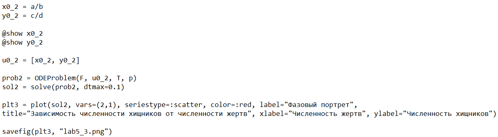

---
## Front matter
lang: ru-RU
title: Лабораторная работа №5
subtitle: Математическое моделирование
author:
  - Чекалова Л. Р.
institute:
  - Российский университет дружбы народов, Москва, Россия
date: 7 марта 2023

## i18n babel
babel-lang: russian
babel-otherlangs: english

## Formatting pdf
toc: false
toc-title: Содержание
slide_level: 2
aspectratio: 169
section-titles: true
theme: metropolis
header-includes:
 - \metroset{progressbar=frametitle,sectionpage=progressbar,numbering=fraction}
 - '\makeatletter'
 - '\beamer@ignorenonframefalse'
 - '\makeatother'
---

# Информация

## Докладчик

:::::::::::::: {.columns align=center}
::: {.column width="70%"}

  * Чекалова Лилия Руслановна
  * студент 3 курса группы НФИбд-02-20
  * ст. б. 1032201654
  * Российский университет дружбы народов
  * [1032201654@pfur.ru](mailto:1032201654@@pfur.ru)

:::
::::::::::::::

# Вводная часть

## Актуальность

- Широкое применение модели в биологии, экономике и др.
- Необходимость визуализировать данные
- Простота построения моделей

## Цели и задачи

- Построить модель Лотки-Вольтерры с помощью Julia и OpenModelica
- Визуализировать построенную модель
- Найти стационарное состояние системы

## Материалы и методы

- Средства языка `Julia` для визуализации данных
- GUI `OMEdit` для визуализации данных на `OpenModelica`
- Результирующие форматы
	- `jl`
	- `mo`
	- `png`

# Ход работы

## Модель "хищник --- жертва"

- $\begin{cases}\frac{\text{d}x}{\text{d}t} = ax(t)-bx(t)y(t)\\\frac{\text{d}y}{\text{d}t} = -cy(t)+dx(t)y(t)\end{cases}$
- $x$ --- число жертв, $y$ --- число хищников
- $a$ --- скорость естественного прироста жертв в отсутствие хищников, $c$ --- естественное вымирание хищников в отсутствие жертв
- после каждого взаимодействия популяция жертв уменьшается, а хищников растет ($-bxy$ и $dxy$)

## Программа на языке Julia

{height=90% width=90%}

## Зависимость числа хищников от числа жертв на языке Julia

{height=90% width=90%}

## Графики изменения числа хищников и жертв на языке Julia

{height=90% width=90%}

## Нахождение стационарного состояния системы на языке Julia

{height=60% width=90%}

{height=40% width=90%}

## Стационарное состояние системы на языке Julia

{height=90% width=90%}

## Программа на языке OpenModelica

{height=90% width=90%}

## Зависимость числа хищников от числа жертв на языке OpenModelica

{height=90% width=90%}

## Графики изменения числа хищников и жертв на языке OpenModelica

{height=90% width=90%}

# Результаты

## Результаты работы

- Отточены навыки работы с Julia и OpenModelica
- Построена модель "хищник --- жертва"
- Построены графики зависимости числа хищников от числа жертв и графики изменения числа хищников и жертв
- Найдено стационарное состояние системы