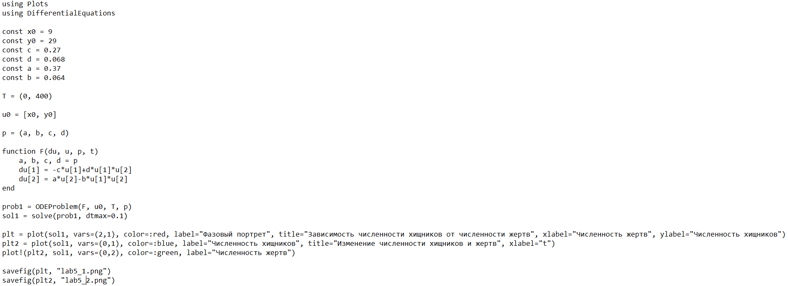
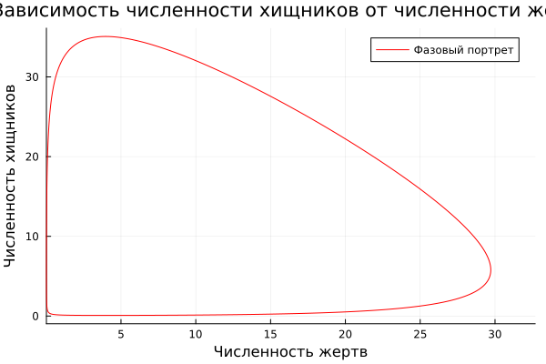
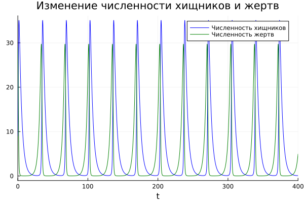
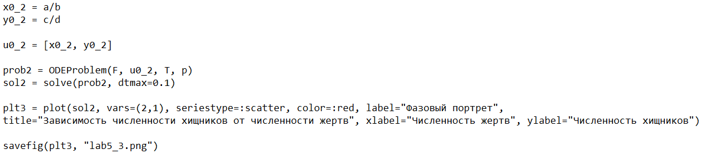
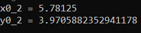
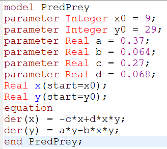
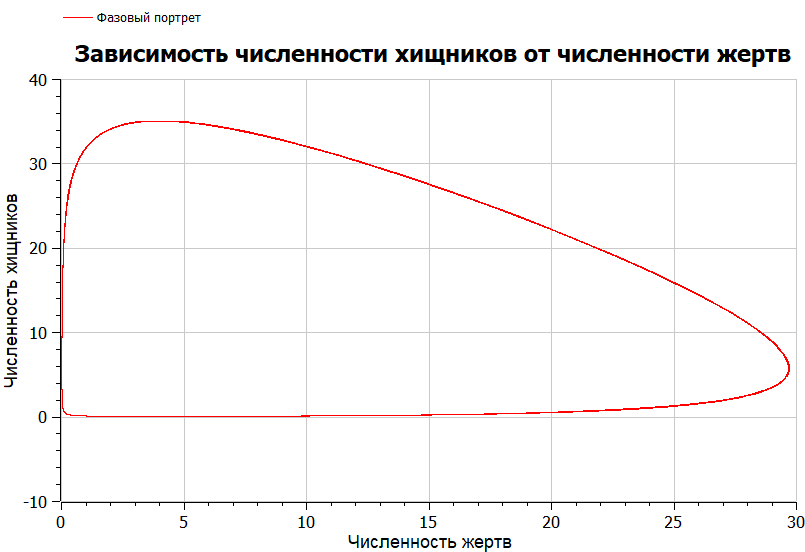
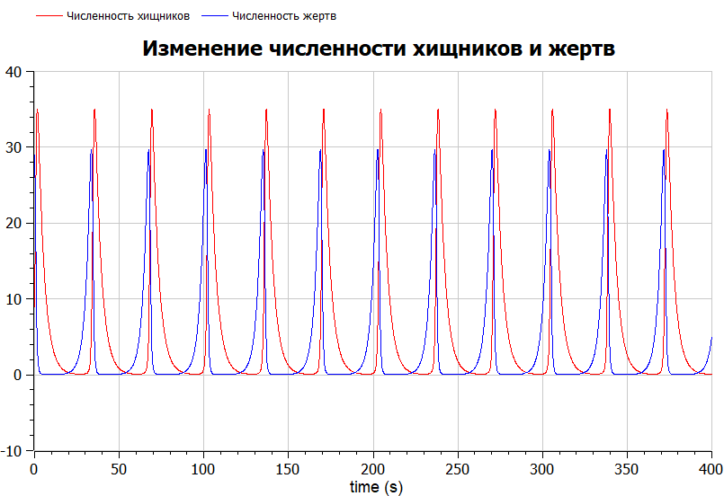

---
## Front matter
title: "Отчёт по лабораторной работе №5"
subtitle: "Математическое моделирование"
author: "Чекалова Лилия Руслановна"

## Generic otions
lang: ru-RU
toc-title: "Содержание"

## Bibliography
bibliography: bib/cite.bib
csl: pandoc/csl/gost-r-7-0-5-2008-numeric.csl

## Pdf output format
toc: true # Table of contents
toc-depth: 2
lof: true # List of figures
lot: true # List of tables
fontsize: 12pt
linestretch: 1.5
papersize: a4
documentclass: scrreprt
## I18n polyglossia
polyglossia-lang:
  name: russian
  options:
	- spelling=modern
	- babelshorthands=true
polyglossia-otherlangs:
  name: english
## I18n babel
babel-lang: russian
babel-otherlangs: english
## Fonts
mainfont: PT Serif
romanfont: PT Serif
sansfont: PT Sans
monofont: PT Mono
mainfontoptions: Ligatures=TeX
romanfontoptions: Ligatures=TeX
sansfontoptions: Ligatures=TeX,Scale=MatchLowercase
monofontoptions: Scale=MatchLowercase,Scale=0.9
## Biblatex
biblatex: true
biblio-style: "gost-numeric"
biblatexoptions:
  - parentracker=true
  - backend=biber
  - hyperref=auto
  - language=auto
  - autolang=other*
  - citestyle=gost-numeric
## Pandoc-crossref LaTeX customization
figureTitle: "Рис."
tableTitle: "Таблица"
listingTitle: "Листинг"
lofTitle: "Список иллюстраций"
lotTitle: "Список таблиц"
lolTitle: "Листинги"
## Misc options
indent: true
header-includes:
  - \usepackage{indentfirst}
  - \usepackage{float} # keep figures where there are in the text
  - \floatplacement{figure}{H} # keep figures where there are in the text
---

# Цель работы

- Познакомиться с простейшей моделью взаимодействия двух видов типа «хищник --- жертва»
- Визуализировать модель с помощью Julia и OpenModelica

# Задание

- Построить график зависимости численности хищников от численности жертв
- Построить графики изменения численности хищников и численности жертв при заданных начальных условиях
- Найти стационарное состояние системы

# Теоретическое введение

Простейшая модель взаимодействия двух видов типа «хищник --- жертва» --- модель Лотки-Вольтерры. Данная модель основывается на следующих предположениях:

- Численность популяции жертв x и хищников y зависят только от времени
(модель не учитывает пространственное распределение популяции на
занимаемой территории)
- В отсутствии взаимодействия численность видов изменяется по модели
Мальтуса, при этом число жертв увеличивается, а число хищников уменьшается
- Естественная смертность жертвы и естественная рождаемость хищника
считаются несущественными
- Эффект насыщения численности обеих популяций не учитывается
- Скорость роста численности жертв уменьшается пропорционально
численности хищников: $$\begin{cases}\frac{\text{d}x}{\text{d}t} = ax(t)-bx(t)y(t)\\\frac{\text{d}y}{\text{d}t} = -cy(t)+dx(t)y(t)\end{cases}$$

В этой модели $x$ –-- число жертв, $y$ --- число хищников. Коэффициент $a$
описывает скорость естественного прироста числа жертв в отсутствие хищников, $с$ --- естественное вымирание хищников, лишенных пищи в виде жертв. Вероятность взаимодействия жертвы и хищника считается пропорциональной как количеству жертв, так и числу самих хищников $(xy)$. Каждый акт взаимодействия уменьшает популяцию жертв, но способствует увеличению популяции хищников (члены $-bxy$ и $dxy$ в правой части уравнения).

Математический анализ этой (жесткой) модели показывает, что имеется
стационарное состояние системы (положение равновесия, не зависящее от времени решение), оно будет в точке: $x_{0}=\frac{c}{d}$, $y_{0}=\frac{a}{b}$. Если начальные значения задать в стационарном состоянии $x(0)=x_{0}$, $y(0)=y_{0}$, то в любой момент времени численность популяций изменяться не будет. При малом отклонении от положения равновесия численности как хищника, так и жертвы с течением времени не возвращаются к равновесным значениям, а совершают периодические колебания вокруг стационарной точки. Амплитуда колебаний и их период определяется начальными значениями численностей $x(0)$, $y(0)$. Колебания совершаются в противофазе.

Более подробно см. в [@lab-theory].

# Выполнение лабораторной работы

По заданной системе пишем программу (рис. @fig:001). В данном случае $x$ --- численность хищников, а $y$ --- численность жертв.

{#fig:001 width=70%}

Получаем график зависимости численности хищников от численности жертв (рис. @fig:002) и графики изменения численности хищников и численности жертв (рис. @fig:003).

{#fig:002 width=70%}

{#fig:003 width=70%}

Добавим в программу нахождение стационарного состояния системы (рис. @fig:004).

{#fig:004 width=70%}

В результате видим, что стационарное состояние находится в точке со следующими координатами (рис. @fig:005).

{#fig:005 width=70%}

Теперь напишем программу для нашего уравнения на OpenModelica (рис. @fig:006).

{#fig:006 width=70%}

Получаем график зависимости числа хищников от числа жертв (рис. @fig:007) и графики изменения числа хищников и числа жертв (рис. @fig:008).

{#fig:007 width=70%}

{#fig:008 width=70%}

# Выводы

В ходе работы мы изучили простейшую модель взаимодействия двух видов типа «хищник --- жертва» --- моделью Лотки-Вольтерры, и применили навыки работы с Julia и OpenModelica для построения графиков, визуализирующих эту модель. Кроме того мы нашли стационарное состояние системы --- оно находится примерно в точке x_{0}=5.78, y_{0}=3.97. Результатом работы стали график зависимости численности хищников от численности жертв, графики изменения численности хищников и численности жертв и график стационарного состояния системы.

На мой взгляд, OpenModelica лучше справляется с задачами, имеющими в основе дифференциальные уравнения, однако Julia дает больше возможностей для визуализации, то есть для работы с графиками.

# Список литературы{.unnumbered}

::: {#refs}
:::
