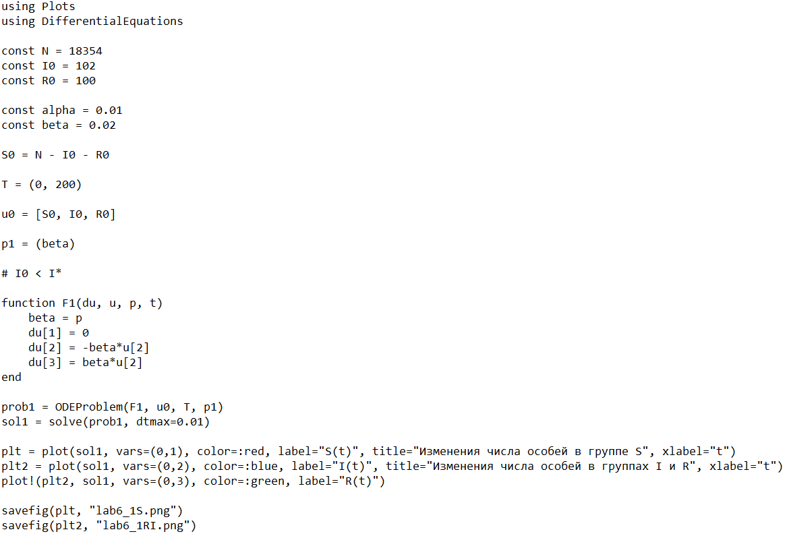
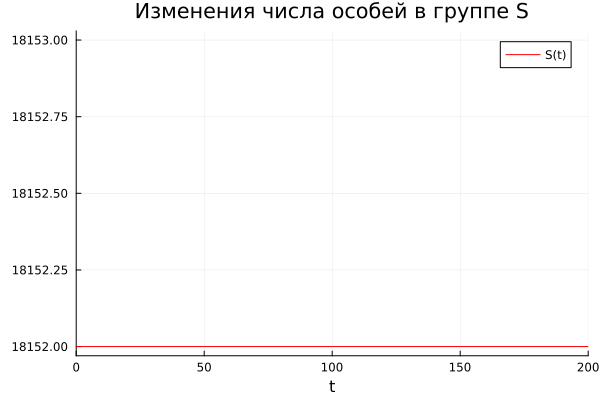
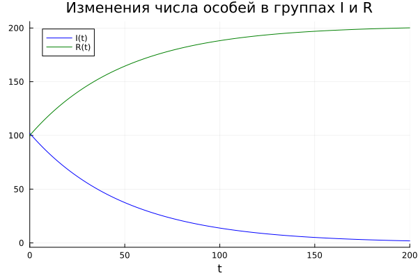
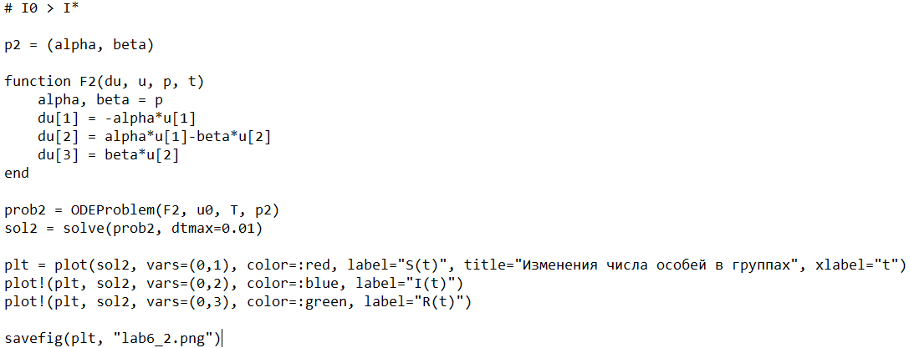
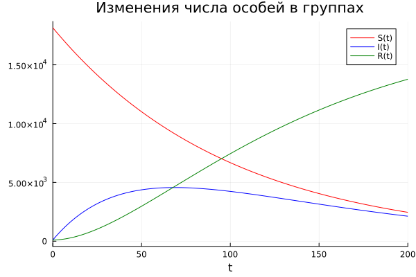
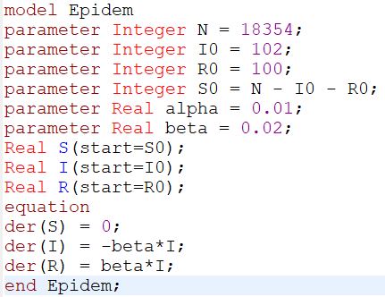
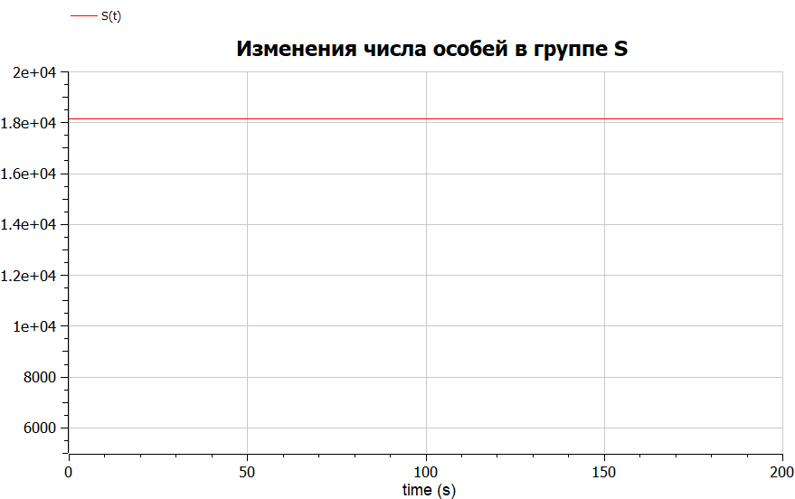
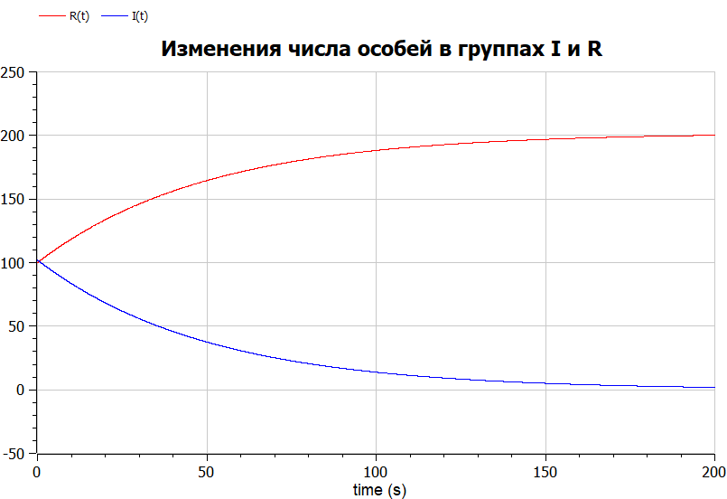
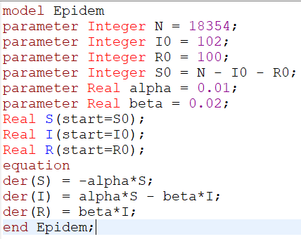
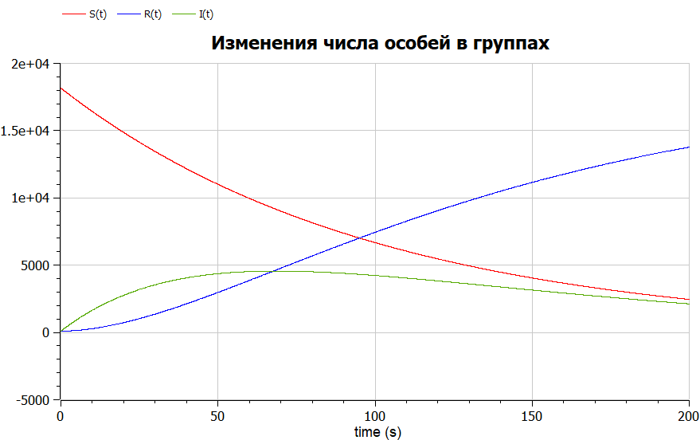

---
## Front matter
lang: ru-RU
title: Лабораторная работа №6
subtitle: Математическое моделирование
author:
  - Чекалова Л. Р.
institute:
  - Российский университет дружбы народов, Москва, Россия
date: 14 марта 2023

## i18n babel
babel-lang: russian
babel-otherlangs: english

## Formatting pdf
toc: false
toc-title: Содержание
slide_level: 2
aspectratio: 169
section-titles: true
theme: metropolis
header-includes:
 - \metroset{progressbar=frametitle,sectionpage=progressbar,numbering=fraction}
 - '\makeatletter'
 - '\beamer@ignorenonframefalse'
 - '\makeatother'
---

# Информация

## Докладчик

:::::::::::::: {.columns align=center}
::: {.column width="70%"}

  * Чекалова Лилия Руслановна
  * студент 3 курса группы НФИбд-02-20
  * ст. б. 1032201654
  * Российский университет дружбы народов
  * [1032201654@pfur.ru](mailto:1032201654@@pfur.ru)

:::
::::::::::::::

# Вводная часть

## Актуальность

- Широкое применение модели в биологии
- Необходимость визуализировать данные
- Простота построения моделей

## Цели и задачи

- Построить модель эпидемии с помощью Julia и OpenModelica
- Визуализировать построенную модель
- Проанализировать результаты

## Материалы и методы

- Средства языка `Julia` для визуализации данных
- GUI `OMEdit` для визуализации данных на `OpenModelica`
- Результирующие форматы
	- `jl`
	- `mo`
	- `png`

# Ход работы

## Модель эпидемии

- $\frac{\text{d}S}{\text{d}t} = \begin{cases}-S\alpha & I(t) > I^{*}\\0 & I(t) \leq I^{*}\end{cases}$
- $\frac{\text{d}I}{\text{d}t} = \begin{cases}S\alpha-I\beta & I(t) > I^{*}\\-I\beta & I(t) \leq I^{*}\end{cases}$
- $\frac{\text{d}R}{\text{d}t} = I\beta$

## Программа на языке Julia для первого случая

{height=90% width=90%}

## График изменения числа особей в группе S на языке Julia

{height=90% width=90%}

## Графики изменения числа особей в группах I и R на языке Julia

{height=90% width=90%}

## Программа на языке Julia для второго случая

{height=90% width=90%}

## Графики изменения числа особей в группах на языке Julia

{height=90% width=90%}

## Программа на языке OpenModelica для первого случая

{height=90% width=90%}

## График изменения числа особей в группе S на языке OpenModelica

{height=90% width=90%}

## Графики изменения числа особей в группах I и R на языке OpenModelica

{height=90% width=90%}

## Программа на языке OpenModelica для второго случая

{height=90% width=90%}

## Графики изменения числа особей в группах на языке OpenModelica

{height=90% width=90%}

# Результаты

## Результаты работы

- Отточены навыки работы с Julia и OpenModelica
- Построена модель эпидемии
- Построены графики изменения числа особей в разных группах