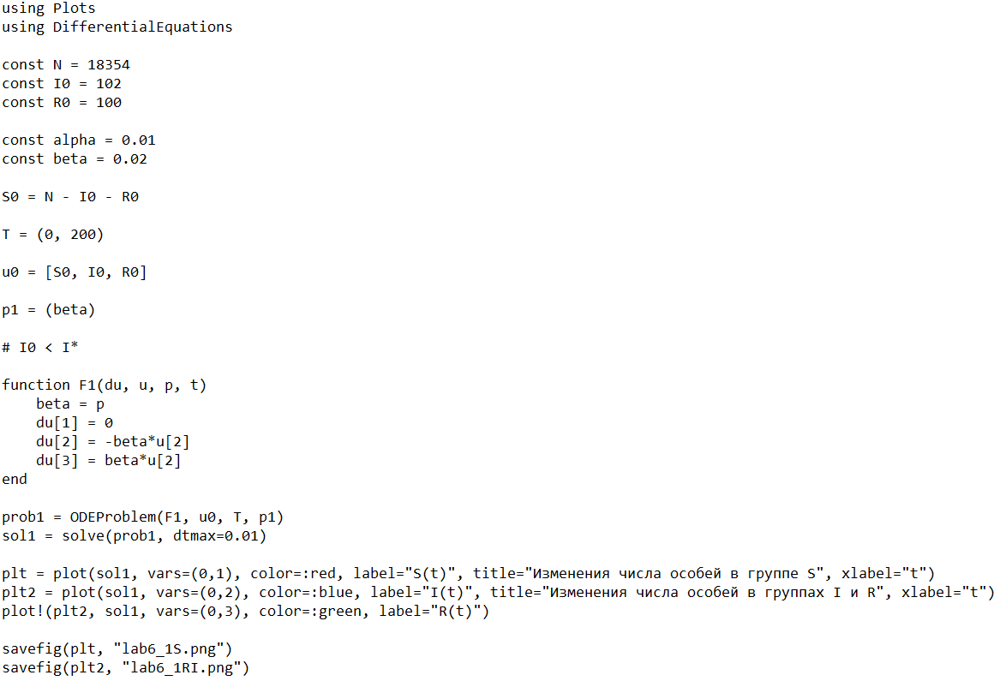
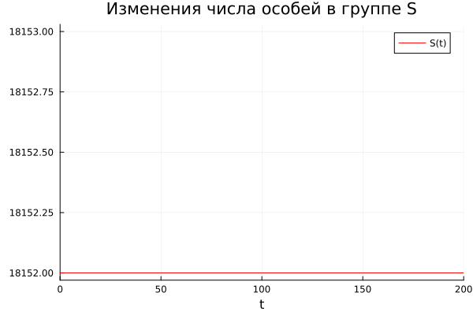
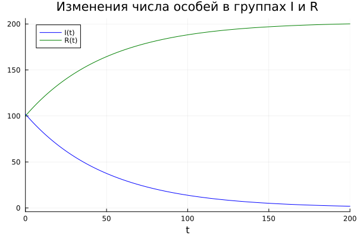
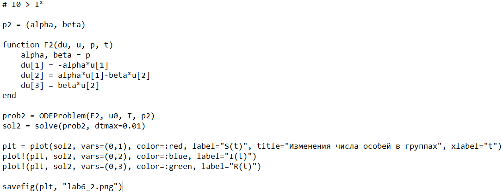
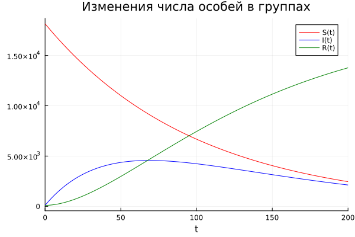
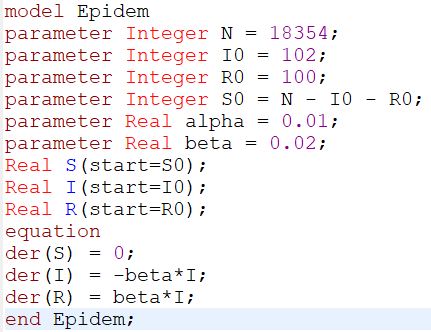
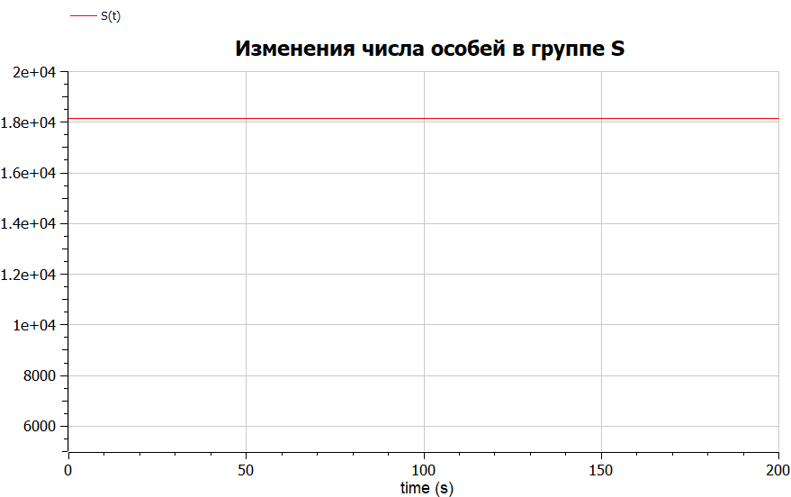
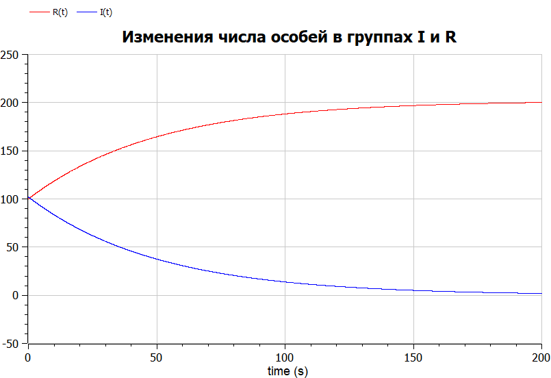
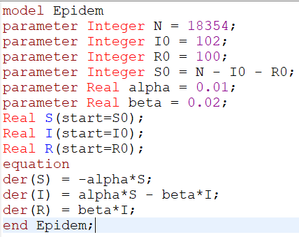
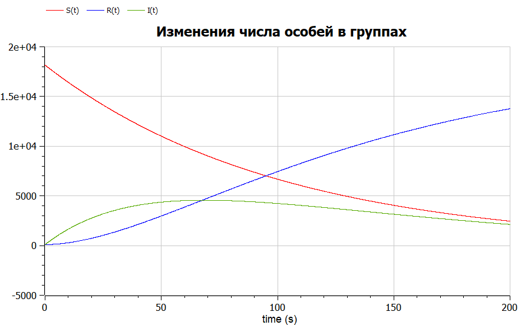

---
## Front matter
title: "Отчёт по лабораторной работе №6"
subtitle: "Математическое моделирование"
author: "Чекалова Лилия Руслановна"

## Generic otions
lang: ru-RU
toc-title: "Содержание"

## Bibliography
bibliography: bib/cite.bib
csl: pandoc/csl/gost-r-7-0-5-2008-numeric.csl

## Pdf output format
toc: true # Table of contents
toc-depth: 2
lof: true # List of figures
lot: true # List of tables
fontsize: 12pt
linestretch: 1.5
papersize: a4
documentclass: scrreprt
## I18n polyglossia
polyglossia-lang:
  name: russian
  options:
	- spelling=modern
	- babelshorthands=true
polyglossia-otherlangs:
  name: english
## I18n babel
babel-lang: russian
babel-otherlangs: english
## Fonts
mainfont: PT Serif
romanfont: PT Serif
sansfont: PT Sans
monofont: PT Mono
mainfontoptions: Ligatures=TeX
romanfontoptions: Ligatures=TeX
sansfontoptions: Ligatures=TeX,Scale=MatchLowercase
monofontoptions: Scale=MatchLowercase,Scale=0.9
## Biblatex
biblatex: true
biblio-style: "gost-numeric"
biblatexoptions:
  - parentracker=true
  - backend=biber
  - hyperref=auto
  - language=auto
  - autolang=other*
  - citestyle=gost-numeric
## Pandoc-crossref LaTeX customization
figureTitle: "Рис."
tableTitle: "Таблица"
listingTitle: "Листинг"
lofTitle: "Список иллюстраций"
lotTitle: "Список таблиц"
lolTitle: "Листинги"
## Misc options
indent: true
header-includes:
  - \usepackage{indentfirst}
  - \usepackage{float} # keep figures where there are in the text
  - \floatplacement{figure}{H} # keep figures where there are in the text
---

# Цель работы

- Познакомиться с простейшей моделью эпидемии
- Визуализировать модель с помощью Julia и OpenModelica

# Задание

- Построить график изменения числа особей в группах S, I и R
- Рассмотреть два случая: где $I(t) \leq I^{*}$  и где $I(t) > I^{*}$

# Теоретическое введение

Предположим, что некая популяция, состоящая из N особей, (считаем, что популяция изолирована) подразделяется на три группы. Первая группа --- это восприимчивые к болезни, но пока здоровые особи, обозначим их через S(t). Вторая группа --- это число инфицированных особей, которые также при этом являются распространителями инфекции, обозначим их I(t). А третья группа, обозначающаяся через R(t) --- это здоровые особи с иммунитетом к болезни.

До того, как число заболевших не превышает критического значения $I^{*}$, считаем, что все больные изолированы и не заражают здоровых. Когда $I(t) > I^{*}$, тогда инфицирование способны заражать восприимчивых к болезни особей.

Таким образом, скорость изменения числа S(t) меняется по следующему закону: $$\frac{\text{d}S}{\text{d}t} = \begin{cases}-S\alpha, & I(t) > I^{*}\\0, & I(t) \leq I^{*}\end{cases}$$

Поскольку каждая восприимчивая к болезни особь, которая, в конце концов, заболевает, сама становится инфекционной, то скорость изменения числа инфекционных особей представляет разность за единицу времени между заразившимися и теми, кто уже болеет и лечится, т.е.: $$\frac{\text{d}I}{\text{d}t} = \begin{cases}S\alpha-I\beta, & I(t) > I^{*}\\-I\beta, & I(t) \leq I^{*}\end{cases}$$

А скорость изменения выздоравливающих особей (при этом приобретающие иммунитет к болезни): $$\frac{\text{d}R}{\text{d}t} = I\beta$$

Постоянные пропорциональности $\alpha$ и $\beta$ --- это коэффициенты заболеваемости и выздоровления соответственно.

Более подробно см. в [@lab-theory].

# Выполнение лабораторной работы

Рассмотрим первый случай, где $I(t) \leq I^{*}$, и напишем программу (рис. @fig:001). В функции F1 опишем, как меняется численность особей в группах S, I и R.

{#fig:001 width=70%}

Результаты сохраняем в два графика (рис. @fig:002 и рис. @fig:003), чтобы можно было увидеть изменения в группах R и I. Так как все инфицированные изолированы, количество особей в группе S не изменяется, число особей в группе I уменьшается, а в группе R --- растет.

{#fig:002 width=70%}

{#fig:003 width=70%}

Изменим функцию, чтобы она описывала ситуацию, где $I(t) > I^{*}$ (рис. @fig:004).

{#fig:004 width=70%}

Получаем графики изменения численности особей для групп S, I, R (рис. @fig:005). Численность в группе R увеличивается, в группе I сначала растет, потом начинает уменьшаться, а в группе S уменьшается, то есть особи из группы S сначала переходят в группу I, а затем в группу R.

{#fig:005 width=70%}

Теперь напишем программу, рассматривающую первый случай, на OpenModelica (рис. @fig:006).

{#fig:006 width=70%}

Получаем также два графика изменения числа особей в группах (рис. @fig:007 и рис. @fig:008). Результаты совпадают с результатами, полученными на Julia.

{#fig:007 width=70%}

{#fig:008 width=70%}

Изменим уравнения, чтобы они описывали второй случай (рис. @fig:009).

{#fig:009 width=70%}

Получаем графики изменения числа особей в группах (рис. @fig:010). Эти графики идентичны графикам, полученным на Julia.

{#fig:010 width=70%}

# Выводы

В ходе работы мы изучили модель эпидемии и применили навыки работы с Julia и OpenModelica для построения графиков, визуализирующих эту модель. Результатом работы стали графики изменения численности особей в группах S, I и R для двух случаев. Мы увидели, что в первом случае численность особей в группе S не изменяется, так как группа I считается изолированной, а во втором случае численность особей в группе S снижается, так как особи сначала переходят в группу I, а потом в группу R. 

Как я уже упоминала, OpenModelica, по моему мнению, лучше справляется с задачами, имеющими в основе дифференциальные уравнения.

# Список литературы{.unnumbered}

::: {#refs}
:::