---
## Front matter
title: "Отчёт по лабораторной работе №7"
subtitle: "Математическое моделирование"
author: "Чекалова Лилия Руслановна"

## Generic otions
lang: ru-RU
toc-title: "Содержание"

## Bibliography
bibliography: bib/cite.bib
csl: pandoc/csl/gost-r-7-0-5-2008-numeric.csl

## Pdf output format
toc: true # Table of contents
toc-depth: 2
lof: true # List of figures
lot: true # List of tables
fontsize: 12pt
linestretch: 1.5
papersize: a4
documentclass: scrreprt
## I18n polyglossia
polyglossia-lang:
  name: russian
  options:
	- spelling=modern
	- babelshorthands=true
polyglossia-otherlangs:
  name: english
## I18n babel
babel-lang: russian
babel-otherlangs: english
## Fonts
mainfont: PT Serif
romanfont: PT Serif
sansfont: PT Sans
monofont: PT Mono
mainfontoptions: Ligatures=TeX
romanfontoptions: Ligatures=TeX
sansfontoptions: Ligatures=TeX,Scale=MatchLowercase
monofontoptions: Scale=MatchLowercase,Scale=0.9
## Biblatex
biblatex: true
biblio-style: "gost-numeric"
biblatexoptions:
  - parentracker=true
  - backend=biber
  - hyperref=auto
  - language=auto
  - autolang=other*
  - citestyle=gost-numeric
## Pandoc-crossref LaTeX customization
figureTitle: "Рис."
tableTitle: "Таблица"
listingTitle: "Листинг"
lofTitle: "Список иллюстраций"
lotTitle: "Список таблиц"
lolTitle: "Листинги"
## Misc options
indent: true
header-includes:
  - \usepackage{indentfirst}
  - \usepackage{float} # keep figures where there are in the text
  - \floatplacement{figure}{H} # keep figures where there are in the text
---

# Цель работы

- Познакомиться с простейшей моделью рекламной кампании
- Визуализировать модель с помощью Julia и OpenModelica

# Задание

- Построить графики распространения рекламы
- Рассмотреть три случая: где $\alpha_{1} \gg \alpha_{2}$, где $\alpha_{1} \ll \alpha_{2}$ и где $\alpha_{1}$ и $\alpha_{2}$ --- периодические функции
- Для второго случая найти момент времени, в который скорость распространения рекламы принимает максимальное значение

# Теоретическое введение

Организуется рекламная кампания нового товара или услуги. Необходимо, чтобы прибыль будущих продаж с избытком покрывала издержки на рекламу. Вначале расходы могут превышать прибыль, поскольку лишь малая часть потенциальных покупателей будет информирована о новинке. Затем, при увеличении числа продаж, возрастает и прибыль, и, наконец, наступит момент, когда рынок насытится, и рекламировать товар станет бесполезным.

Предположим, что торговыми учреждениями реализуется некоторая продукция, о которой в момент времени t из числа потенциальных покупателей N знает лишь n покупателей. Для ускорения сбыта продукции запускается реклама по радио, телевидению и других средств массовой информации. После запуска рекламной кампании информация о продукции начнет распространяться среди потенциальных покупателей путем общения друг с другом. Таким образом, после запуска рекламных объявлений скорость изменения числа знающих о продукции людей пропорциональна как числу знающих о товаре покупателей, так и числу покупателей, о нем не знающих.

Модель рекламной кампании описывается следующими величинами. Считаем, что $\frac{\text{d}n}{\text{d}t}$ --- скорость изменения со временем числа потребителей, узнавших о товаре и готовых его купить, t --- время, прошедшее с начала рекламной кампании, n(t) --- число уже информированных клиентов. Эта величина пропорциональна числу покупателей, еще не знающих о нем, это описывается следующим образом: $\alpha_{1}(t)(N-n(t))$, где N --- общее число потенциальных платежеспособных покупателей, $\alpha_{1}(t) > 0$ характеризует интенсивность рекламной кампании (зависит от затрат на рекламу в данный момент времени).

Помимо этого, узнавшие о товаре потребители также распространяют полученную информацию среди потенциальных покупателей, не знающих о нем (в этом случае работает т.н. сарафанное радио). Этот вклад в рекламу описывается величиной $\alpha_{2}(t)n(t)(N-n(t))$, эта величина увеличивается с увеличением потребителей узнавших о товаре.

Таким образом, математическая модель распространения рекламы описывается уравнением: $$\frac{\text{d}n}{\text{d}t} = (\alpha_{1}(t)+\alpha_{2}(t)n(t))(N-n(t))$$.

Более подробно см. в [@lab-theory].

# Выполнение лабораторной работы

Рассмотрим первый случай, где $\alpha_{1} \gg \alpha_{2}$, и напишем программу (рис. @fig:001). В функции F1 опишем, как меняется скорость распространения рекламы.

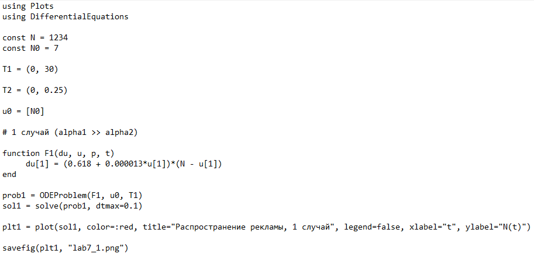{#fig:001 width=70%}

Результаты сохраняем в виде графика (рис. @fig:002). Мы видим, что количество осведомленных о товаре клиентов постепенно растет, пока не достигает максимально возможного --- N.

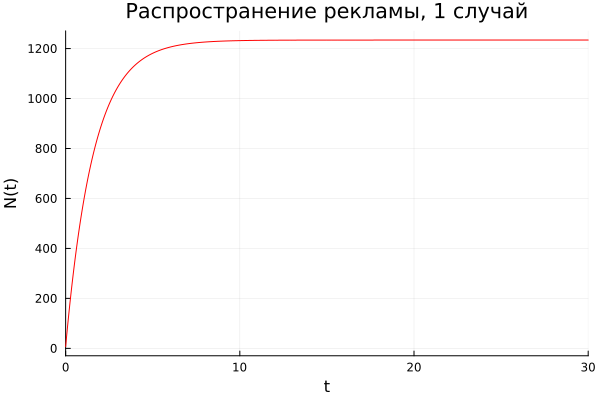{#fig:002 width=70%}

Изменим функцию, чтобы она описывала ситуацию, где $\alpha_{1} \ll \alpha_{2}$ (рис. @fig:003). Добавим в функцию F1 нахождение момента времени, в который скорость распространения рекламы, то есть производная, максимальна. Выведем результат в консоль (рис. @fig:004).

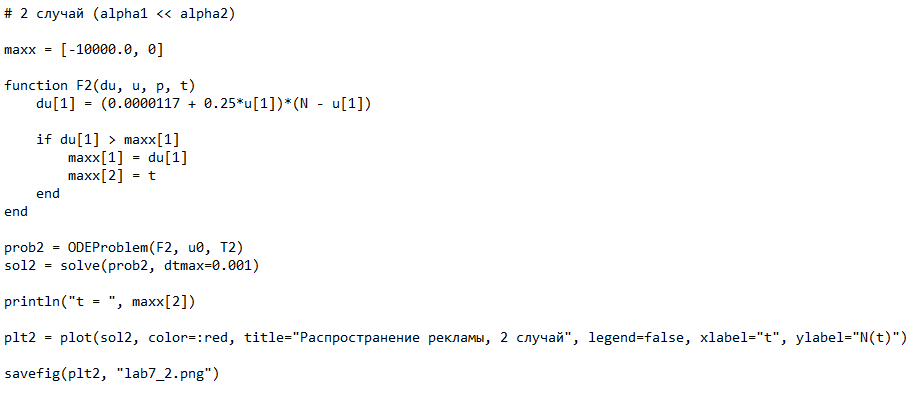{#fig:003 width=70%}

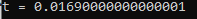{#fig:004 width=70%}

Получаем график распространения рекламы для второго случая (рис. @fig:005). График принимает вид логистической кривой: сначала численность осведомленных о товаре клиентов растет медленно, но затем начинает увеличиваться быстрее.

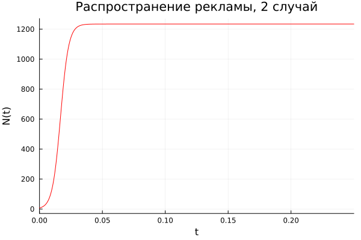{#fig:005 width=70%}

Наконец поменяем функцию, чтобы она описывала ситуацию, где $\alpha_{1}$ и $\alpha_{2}$ --- периодические функции (рис. @fig:006).

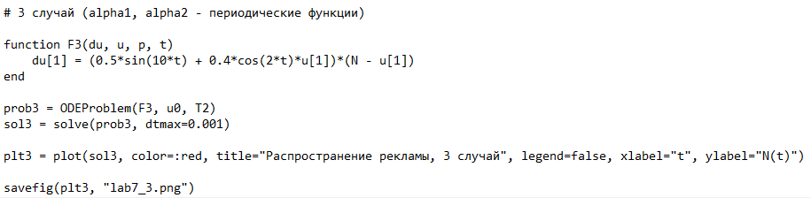{#fig:006 width=70%}

Получаем график распространения рекламы для третьего случая (рис. @fig:007). График принимает вид, схожий со вторым случаем: численность осведомленных о товаре клиентов сначала возрастает медленно, а затем начинает стремительно увеличиваться.

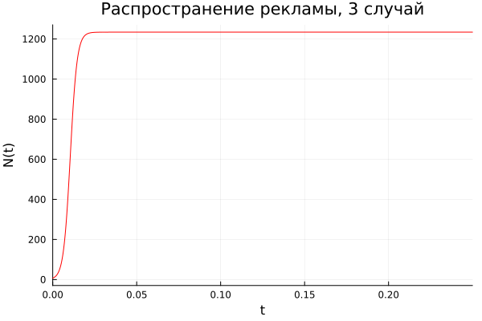{#fig:007 width=70%}

Теперь напишем программу, рассматривающую первый случай, на OpenModelica (рис. @fig:008).

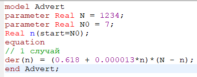{#fig:008 width=70%}

Получаем также график распространения рекламы (рис. @fig:009). Результаты совпадают с результатами, полученными на Julia.

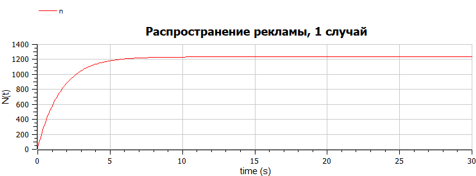{#fig:009 width=70%}

Изменим уравнение, чтобы оно описывало второй случай (рис. @fig:010).

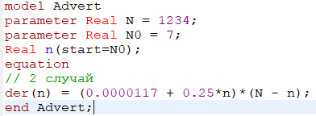{#fig:010 width=70%}

Получаем график распространения рекламы (рис. @fig:011). Этот график идентичен графику, полученному на Julia.

{#fig:011 width=70%}

Наконец поменяем уравнение, чтобы оно подходило под третий случай (рис. @fig:012).

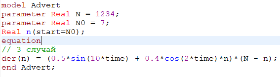{#fig:012 width=70%}

Получаем график распространения рекламы (рис. @fig:013). Наблюдаем те же результаты, что и на Julia.

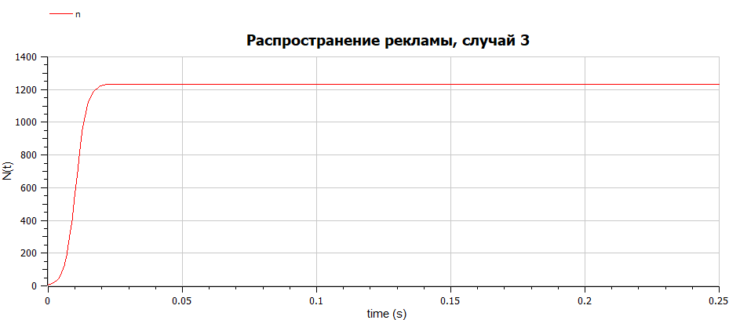{#fig:013 width=70%}

# Выводы

В ходе работы мы изучили модель рекламной кампании и применили навыки работы с Julia и OpenModelica для построения графиков, визуализирующих эту модель. Результатом работы стали графики распространения рекламы для трех случаев. Мы увидели, что в первом случае численность осведомленных клиентов изменяется плавно, так как $\alpha_{1} \gg \alpha_{2}$, а для второго и третьего случаев численность осведомленных клиентов растет стремительно за короткие сроки, и график принимает вид логистической кривой, так как $\alpha_{1} \ll \alpha_{2}$. Также для второго случая мы нашли момент времени, в который скорость распространения рекламы максимальна, это значение примерно равно 0.017 секунды.

Как говорилось ранее, на мой взгляд, OpenModelica лучше решает задачи, основанные на дифференциальных уравнениях.

# Список литературы{.unnumbered}

::: {#refs}
:::