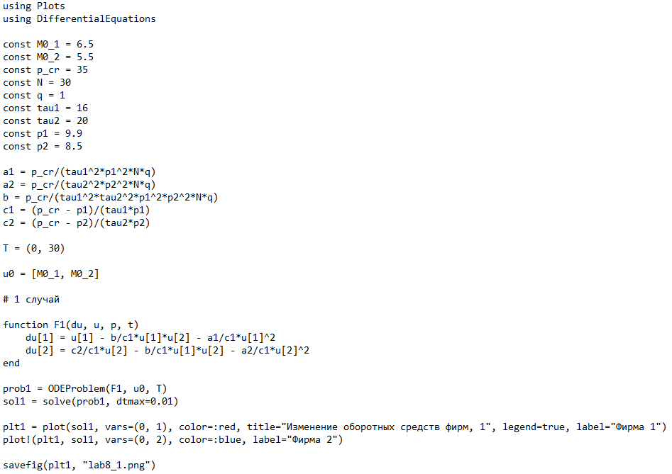
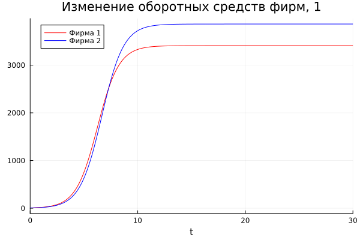
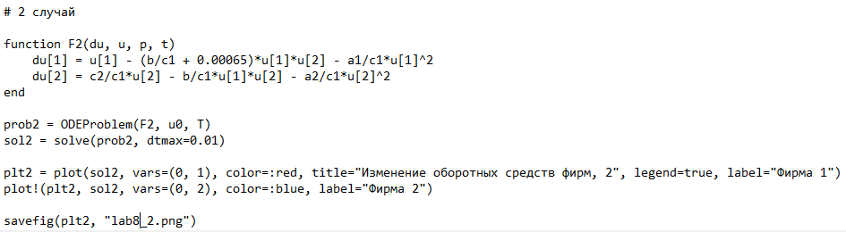
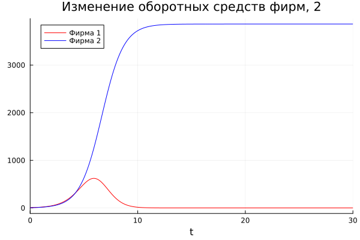
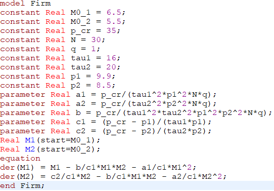
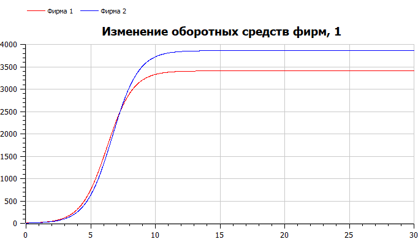
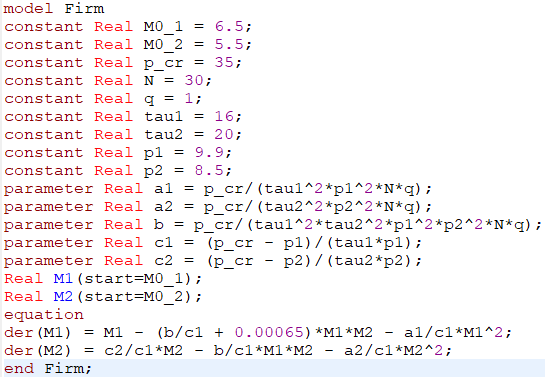
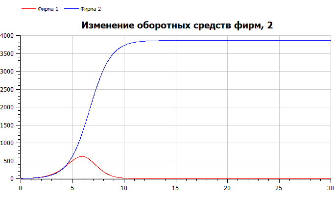

---
## Front matter
title: "Отчёт по лабораторной работе №8"
subtitle: "Математическое моделирование"
author: "Чекалова Лилия Руслановна"

## Generic otions
lang: ru-RU
toc-title: "Содержание"

## Bibliography
bibliography: bib/cite.bib
csl: pandoc/csl/gost-r-7-0-5-2008-numeric.csl

## Pdf output format
toc: true # Table of contents
toc-depth: 2
lof: true # List of figures
lot: true # List of tables
fontsize: 12pt
linestretch: 1.5
papersize: a4
documentclass: scrreprt
## I18n polyglossia
polyglossia-lang:
  name: russian
  options:
	- spelling=modern
	- babelshorthands=true
polyglossia-otherlangs:
  name: english
## I18n babel
babel-lang: russian
babel-otherlangs: english
## Fonts
mainfont: PT Serif
romanfont: PT Serif
sansfont: PT Sans
monofont: PT Mono
mainfontoptions: Ligatures=TeX
romanfontoptions: Ligatures=TeX
sansfontoptions: Ligatures=TeX,Scale=MatchLowercase
monofontoptions: Scale=MatchLowercase,Scale=0.9
## Biblatex
biblatex: true
biblio-style: "gost-numeric"
biblatexoptions:
  - parentracker=true
  - backend=biber
  - hyperref=auto
  - language=auto
  - autolang=other*
  - citestyle=gost-numeric
## Pandoc-crossref LaTeX customization
figureTitle: "Рис."
tableTitle: "Таблица"
listingTitle: "Листинг"
lofTitle: "Список иллюстраций"
lotTitle: "Список таблиц"
lolTitle: "Листинги"
## Misc options
indent: true
header-includes:
  - \usepackage{indentfirst}
  - \usepackage{float} # keep figures where there are in the text
  - \floatplacement{figure}{H} # keep figures where there are in the text
---

# Цель работы

- Познакомиться с моделью конкуренции двух фирм
- Визуализировать модель с помощью Julia и OpenModelica

# Задание

- Построить графики изменения оборотных средств двух фирм
- Рассмотреть два случая: где борьба ведется только рыночными методами и где учитываются социально-психологические факторы

# Теоретическое введение

Изучим сначала первый случай. Рассмотрим две фирмы, производящие взаимозаменяемые товары одинакового качества и находящиеся в одной рыночной нише. Последнее означает, что у потребителей в этой нише нет априорных предпочтений, и они приобретут тот или иной товар, не обращая внимания на знак фирмы.

В этом случае, на рынке устанавливается единая цена, которая определяется балансом суммарного предложения и спроса. Иными словами, в рамках нашей модели конкурентная борьба ведётся только рыночными методами. То есть, конкуренты могут влиять на противника путем изменения параметров своего производства: себестоимость, время цикла, но не могут прямо вмешиваться в ситуацию на рынке ("назначать" цену или влиять на потребителей каким-либо иным способом.)

Уравнения динамики оборотных средств запишем в виде: $\begin{cases}\frac{\text{d}M_{1}}{\text{d}t} = -\frac{M_{1}}{\tau_{1}}+N_{1}q(1-\frac{p}{p_{cr}})p-\kappa_{1}\\\frac{\text{d}M_{2}}{\text{d}t} = -\frac{M_{2}}{\tau_{2}}+N_{2}q(1-\frac{p}{p_{cr}})p-\kappa_{2}\end{cases}$.

Учтем, что товарный баланс устанавливается быстро, то есть, произведенный каждой фирмой товар не накапливается, а реализуется по цене p. Тогда $\begin{cases}\frac{M_{1}}{\tau_{1}\tilde{p}_{1}} = N_{1}q(1 - \frac{p}{p_{cr}})\\\frac{M_{2}}{\tau_{2}\tilde{p}_{2}} = N_{2}q(1 - \frac{p}{p_{cr}})\end{cases}$, где $\tilde{p}_{1}$ и $\tilde{p}_{2}$ --- себестоимости товаров в первой и второй фирме.

Представим последнюю систему уравнений в виде $\begin{cases}\frac{\text{d}M_{1}}{\text{d}t} = -\frac{M_{1}}{\tau_{1}}(1-\frac{p}{\tilde{p}_{1}})-\kappa_{1}\\\frac{\text{d}M_{2}}{\text{d}t} = -\frac{M_{2}}{\tau_{2}}(1-\frac{p}{\tilde{p}_{2}})-\kappa_{2}\end{cases}$

Проведем еще ряд преобразований и получим систему уравнений для первого случая: $\begin{cases}\frac{\text{d}M_{1}}{\text{d}\theta} = M_{1}-\frac{b}{c_{1}}M_{1}M_{2}-\frac{a_{1}}{c_{1}}M_{1}^{2}\\\frac{\text{d}M_{2}}{\text{d}\theta} = \frac{c_{2}}{c_{1}}M_{2}-\frac{b}{c_{1}}M_{1}M_{2}-\frac{a_{2}}{c_{1}}M_{2}^{2}\end{cases}$.

Для второго случая по аналогии система уравнений примет вид $\begin{cases}\frac{\text{d}M_{1}}{\text{d}\theta} = M_{1}-(\frac{b}{c_{1}} + k)M_{1}M_{2}-\frac{a_{1}}{c_{1}}M_{1}^{2}\\\frac{\text{d}M_{2}}{\text{d}\theta} = \frac{c_{2}}{c_{1}}M_{2}-\frac{b}{c_{1}}M_{1}M_{2}-\frac{a_{2}}{c_{1}}M_{2}^{2}\end{cases}$.

В этих формулах $a_{1} = \frac{p_{cr}}{\tau_{1}^{2}\tilde{p}_{1}^{2}Nq}$, $a_{2} = \frac{p_{cr}}{\tau_{2}^{2}\tilde{p}_{2}^{2}Nq}$, $b = \frac{p_{cr}}{\tau_{1}^{2}\tilde{p}_{1}^{2}\tau_{2}^{2}\tilde{p}_{2}^{2}Nq}$, $c_{1} = \frac{p_{cr}-\tilde{p}_{1}}{\tau_{1}\tilde{p}_{1}}$, $c_{2} = \frac{p_{cr}-\tilde{p}_{2}}{\tau_{2}\tilde{p}_{2}}$.

Более подробно см. в [@lab-theory].

# Выполнение лабораторной работы

Рассмотрим первый случай, где борьба ведется только рыночными методами, и напишем программу (рис. @fig:001). В функции F1 опишем, как меняются оборотные средства двух фирм.

{#fig:001 width=70%}

Результаты сохраняем в виде графика (рис. @fig:002). Мы видим, что рост оборотных средств предприятий идет независимо друг от друга. В математической модели это отражается в коэффициенте, стоящим перед членом $M_{1}M_{2}$, у нас он одинаковый в обоих уравнениях ($\frac{b}{c_{1}}$). Каждая фирма достигает свое максимальное значение объема продаж и остается на рынке с этим значением, то есть каждая фирма захватывает свою часть рынка потребителей, которая не изменяется.

{#fig:002 width=70%}

Изменим функцию, чтобы она учитывала социально-психологические факторы (рис. @fig:003). Для этого в первом уравнении функции F1 меняем коэффициент перед членом $M_{1}M_{2}$.

{#fig:003 width=70%}

Получаем график динамики изменения объемов продаж для второго случая (рис. @fig:004). По графику видно, что первая фирма, несмотря на начальный рост, достигнув своего максимального объема продаж, начитает нести убытки и, в итоге, терпит банкротство. Динамика роста объемов оборотных средств второй фирмы остается без изменения: достигнув максимального значения, остается на этом уровне.

{#fig:004 width=70%}

Теперь напишем программу, рассматривающую первый случай, на OpenModelica (рис. @fig:005).

{#fig:005 width=70%}

Получаем график изменения оборотных средств для двух фирм (рис. @fig:006). Результаты совпадают с результатами, полученными на Julia.

{#fig:006 width=70%}

Изменим одно из уравнений, чтобы оно описывало второй случай (рис. @fig:007).

{#fig:007 width=70%}

Получаем график динамики изменения объемов продаж для двух фирм (рис. @fig:008). Этот график идентичен графику, полученному на Julia.

{#fig:008 width=70%}

# Выводы

В ходе работы мы изучили модель конкуренции двух фирм и применили навыки работы с Julia и OpenModelica для построения графиков, визуализирующих эту модель. Результатом работы стали графики динамики изменения объемов продаж для двух случаев. Мы увидели, что в первом случае оборотные средства двух предприятий изменяются независимо друг от друга и каждая фирма занимает свою нишу в рынке, а для второго случая первая компания вскоре начинает нести убытки и вскоре терпит банкротство.

По моему мнению, OpenModelica лучше решает задачи, в основе которых лежат дифференциальные уравнения.

# Список литературы{.unnumbered}

::: {#refs}
:::