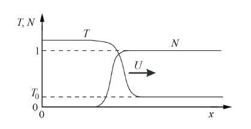
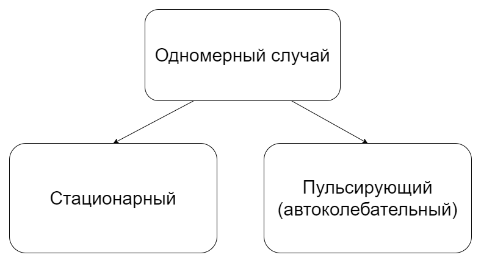
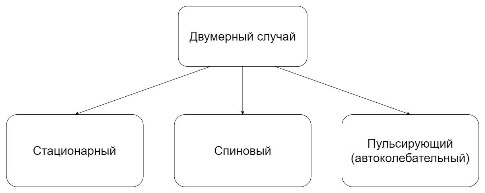

---
## Front matter
lang: ru-RU
title: Теплопроводность и детерминированное горение
subtitle: Групповой проект
author:
  - Тагиев Б.А.
  - Чекалова Л.Р.
  - Сергеев Т.С.
  - Саттарова В.В.
  - Прокошев Н.Е.
  - Тарусов А.С.
institute:
  - Российский университет дружбы народов
date: 2023

## i18n babel
babel-lang: russian
babel-otherlangs: english

## Formatting pdf
toc: false
toc-title: Содержание
slide_level: 2
aspectratio: 169
section-titles: true
theme: metropolis
header-includes:
 - \metroset{progressbar=frametitle,sectionpage=progressbar,numbering=fraction}
 - '\makeatletter'
 - '\beamer@ignorenonframefalse'
 - '\makeatother'
---
# Введение

## Актуальность

- Повсеместное использование процессов горения
- Необходимость разработки правил противопожарной безопасности
- Необходимость минимизации ущерба, наносимого горением окружающей среде

## Объект и предмет исследования

- Горение как сложный процесс
- Режимы горения
- Факторы, определяющие режим горения

# Размерная система уравнений

## Размерная система уравнений

Допустим, что скорость химической реакции будет расти при увеличении температуры. В такой системе допускается переход тепла из разогретой области в новые слои, тем самым ускоряя в них реакцию. Некоторые условия позволяют процессу распространяться неограниченно далеко.

## Размерная система уравнений

В первом приближении для моделирования волны горения ограничимся системой с постоянными коеффициентами теплоемкости и теплопроводности. Будем моделировать химическую реакцию простейшим способом: вещество вида $A$ переходит в $B$ экзотермически. Воспользуемся законом Аррениуса для реакции первого пордка для скорости химической реакции:

$$\frac{\partial N}{\partial t} = -\frac{N}{\tau}e^{-E/RT}$$

## Размерная система уравнений

В одномерном случае надо добавить еще уравнение теплопроводности с дополнительным членом, отвечающим за энерговыделение:

$$\rho c\frac{\partial T}{\partial t} = k\frac{\partial^2 T}{\partial x^2} - \rho Q\frac{\partial N}{\partial t}$$

## Размерная система уравнений

В этой системе уравнений возможен режим в виде самостоятельно распространяющейся волны горения. На рисунке показан пример волны, распространяющейся вдоль $X$ со скоростью $U$ ($T_{0}$ - температура перед волной горения).

{#graph width=50%}

# Система уравнений для безразмерных величин

## Система уравнений для безразмерных величин

- Безразмерная температура $\tilde{T} = \frac{cT}{Q}$
- Безразмерная энергия активации $\tilde{E} = \frac{cE}{RQ}$
- Уравнение теплопроводности $c\rho\frac{\partial T}{\partial t} = \kappa\frac{\partial^{2} T}{\partial x^{2}} - Q\rho\frac{\partial N}{\partial t}$
- Система уравнений для описания процесса: $\begin{cases}\frac{\partial T}{\partial t} = \chi\frac{\partial^{2} T}{\partial x^{2}} - \frac{\partial N}{\partial t}\\\frac{\partial N}{\partial t} = -\frac{N}{\tau}e^{-\frac{E}{T}}\end{cases}$
- $\chi = \frac{\kappa}{c\rho}$ --- коэффициент температуропроводности

*Примечание: знак $\sim$ для безразмерных величин $\tilde{T}$ и $\tilde{E}$ в системе уравнений опущен*

# Различные режимы горения

## Одномерный случай

{width=70%}

## Одномерный случай

- $E < E_{*}$ - стационарное горение
- $E < E_{*}$ - пульсирующее горение

Теоретически можно показать, что при $T_{0} \ll 1$ критическое значение $E_{*} = {6,56}$. При увеличении начальной температуры $T_{0}$ критическое значение $E_{*}$ возрастает.

## Двумерный случай

Для моделирования волны горения в двумерном случае в первое уравнение системы нужно добавить перенос тепла по второй координате – $\chi\frac{\partial^{2} T}{\partial y^{2}}$. 

$\begin{cases}\frac{\partial T}{\partial t} = \chi\frac{\partial^{2} T}{\partial x^{2}} - \frac{\partial N}{\partial t}\\\frac{\partial N}{\partial t} = -\frac{N}{\tau}e^{-\frac{E}{T}}\end{cases}$ $\Rightarrow$ $\begin{cases}\frac{\partial T}{\partial t} = \chi\frac{\partial^{2} T}{\partial x^{2}}+ \chi\frac{\partial^{2} T}{\partial y^{2}} - \frac{\partial N}{\partial t}\\\frac{\partial N}{\partial t} = -\frac{N}{\tau}e^{-\frac{E}{T}}\end{cases}$

## Двумерный случай

{width=70%}

## Двумерный случай

Область существования спинового режима – $E > E^{**}$

$T_{0} \ll 1 \Rightarrow E_{**} = {6,3}$

Видно, что $E^{*} > E^{**}$ 

## Литература

- Медведев Д. А., Куперштох А. Л., Прууэл Э. Р., Сатонкина Н. П., Карпов Д. И. Моделирование физических процессов и явлений на ПК: Учеб. пособие / Новосибирск: Новосиб. гос. ун-т., 2010. / ISBN 978-5-94356-933-3 
- Борисова О. А., Лидский Б. В. Устойчивость горения безгазовых
систем по отношению к двумерным возмущениям // Химическая
физика. 1986. Т. 5, № 6. С. 822–830.
- Максимов Ю. М., Мержанов А. Г. Режимы неустойчивого горения
безгазовых систем // Физика горения и взрыва. 1979. Т. 5, № 6.
С. 51–58.

