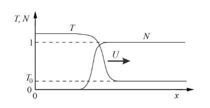

---
## Front matter
title: "Теплопроводность и детерминированное горение"
subtitle: "Групповой проект"
author: 
  - Тагиев Б.А.
  - Чекалова Л.Р.
  - Сергеев Т.С.
  - Саттарова В.В.
  - Прокошев Н.Е.
  - Тарусов А.С.

## Generic otions
lang: ru-RU
toc-title: "Содержание"

## Bibliography
bibliography: bib/cite.bib
csl: pandoc/csl/gost-r-7-0-5-2008-numeric.csl

## Pdf output format
toc: true # Table of contents
toc-depth: 2
lof: true # List of figures
lot: false # List of tables
fontsize: 12pt
linestretch: 1.5
papersize: a4
documentclass: scrreprt
## I18n polyglossia
polyglossia-lang:
  name: russian
  options:
	- spelling=modern
	- babelshorthands=true
polyglossia-otherlangs:
  name: english
## I18n babel
babel-lang: russian
babel-otherlangs: english
## Fonts
mainfont: PT Serif
romanfont: PT Serif
sansfont: PT Sans
monofont: PT Mono
mainfontoptions: Ligatures=TeX
romanfontoptions: Ligatures=TeX
sansfontoptions: Ligatures=TeX,Scale=MatchLowercase
monofontoptions: Scale=MatchLowercase,Scale=0.9
## Biblatex
biblatex: true
biblio-style: "gost-numeric"
biblatexoptions:
  - parentracker=true
  - backend=biber
  - hyperref=auto
  - language=auto
  - autolang=other*
  - citestyle=gost-numeric
## Pandoc-crossref LaTeX customization
figureTitle: "Рис."
tableTitle: "Таблица"
listingTitle: "Листинг"
lofTitle: "Список иллюстраций"
lotTitle: "Список таблиц"
lolTitle: "Листинги"
## Misc options
indent: true
header-includes:
  - \usepackage{indentfirst}
  - \usepackage{float} # keep figures where there are in the text
  - \floatplacement{figure}{H} # keep figures where there are in the text
---
# Актуальность

Актуальность темы выражается в повсеместном использовании процессов горения, например, в быту и промышленности. В связи с этим возникает потребность в изучении этих процессов для разработки и усовершенствования системы правил пожарной безопасности, а также для создания методов минимизации ущерба, наносимого горением окружающей среде.

# Объект и предмет исследования

Объектом исследования является горение как сложный процесс. Предметами исследования полагаем режимы горения и факторы, определяющие режимы горения.

# Размерная система уравнений

Рассмотрим среду с учетом теплопроводности, в которой возможна экзотермическая (с выделением тепла) химическая реакция, ведь численно решая некоторую систему дифференциальных уравнений, можно исследовать различные режимы горения в одномерном и двумерном случаях.

Допустим, что скорость химической реакции будет расти при увеличении температуры. В такой системе допускается переход тепла из разогретой области в новые слои, тем самым ускоряя в них реакцию. Некоторые условия позволяют процессу распространяться неограниченно далеко. В первом приближении для моделирования волны горения ограничимся системой с постоянными коеффициентами теплоемкости и теплопроводности. Будем моделировать химическую реакцию простейшим способом: вещество вида $A$ переходит в $B$ экзотермически. Воспользуемся законом Аррениуса для реакции первого пордка для скорости химической реакции

$$\frac{\partial N}{\partial t} = -\frac{N}{\tau}e^{-E/RT}$$

Где $N$ -- доля вещества, которое еще не прореагироволо из $A$, меняющаяся от 1 -- исходное вещество, до 0 -- все вещество прореагироволо, $E$ -- энергия активации химической реакции, $\tau$ -- характерное время перераспределения энергии, $T$ -- температура в данной точке. В одномерном случае надо добавить еще уравнение теплопроводности с дополнительным членом, отвечающим за энерговыделение:

$$\rho c\frac{\partial T}{\partial t} = k\frac{\partial^2 T}{\partial x^2} - \rho Q\frac{\partial N}{\partial t}$$

Где $\rho$ - плотность, $c$ - удельная теплоемкость, $k$ - коеффициент теплопроводности, $Q$ - удельное энерговыделение при химической реакции. В этой системе уравнений возможен режим в виде самостоятельно распространяющейся волны горения. На рисунке 1 показан пример волны, распространяющейся вдоль $X$ со скоростью $U$ ($T_{0}$ - температура перед волной горения).

# Система уравнений для безразмерных величин

Поделим уравнение теплопроводности $c\rho\frac{\partial T}{\partial t} = \kappa\frac{\partial^{2} T}{\partial x^{2}} - Q\rho\frac{\partial N}{\partial t}$ на $Q\rho$ и перейдем к безразмерным температуре $\tilde T = \frac{cT}{Q}$ и энергии активации $\tilde E = \frac{cE}{RQ}$ в полученном уравнении и в законе Аррениуса для реакции первого порядка $\frac{\partial N}{\partial t} = -\frac{N}{\tau}e^{-\frac{E}{RT}}$.

Получим систему уравнений $\begin{cases}\frac{\partial T}{\partial t} = \chi\frac{\partial^{2} T}{\partial x^{2}} - \frac{\partial N}{\partial t}\\\frac{\partial N}{\partial t} = -\frac{N}{\tau}\exp^{-\frac{E}{T}}\end{cases}$, где $\chi = \frac{\kappa}{c\rho}$ --- коэффициент температуропроводности. Знак $\sim$ для безразмерных величин $\tilde{T}$ и $\tilde{E}$ опущен для упрощения восприятия.

Безразмерные температура и энергия активации теперь измеряются в энергетических единицах, равных энергии, выделяющейся в узле при полном выгорании вещества.

Таким образом, из закона сохранения энергии следует, что в волне горения температура всегда должна подниматься на единицу от начальной температуры среды $T_{0}$. Получившаяся система более наглядно и просто описывает явление горения, и в дальнейшем мы будем использовать именно ее.

# Различные режимы горения

Из имеющихся в системе уравнений трех параметров наиболее интересна безразмерная энергия активации E, равная отношению энергии активации к теплоте реакции. Именно этот параметр определяет режим волны горения, а остальные параметры τ и χ только масштабируют явление во времени и в пространстве.

Для начала рассмотрим одномерный случай. Здесь возможны два режима горения: стационарный и пульсирующий (автоколебательный). В первом – скорость распространения волны постоянна, а профили температуры и концентрации переносятся вдоль оси X не деформируясь. Во втором – скорость волны переменная, и горение распространяется в виде чередующихся вспышек и угасаний. От значения параметра E зависит, какой режим реализуется. Существует критическое значение безразмерной энергии активации $E_{*}$. При $E < E_{*}$ – стационарное горение, а при $E > E_{*}$ – пульсирующее. Теоретически можно показать, что при $T_{0} \ll 1$ критическое значение $E_{*} = {6,56}$. При увеличении начальной температуры $T_{0}$ критическое значение $E_{*}$ возрастает. 

Для моделирования волны горения в двумерном случае в первое уравнение системы нужно добавить перенос тепла по второй координате – $\chi\frac{\partial^{2} T}{\partial y^{2}}$. Если использовать периодические граничные условия по координате Y, то такая постановка соответствует горению, распространяющемуся по поверхности пустотелого теплопроводящего цилиндра, покрытого реагирующим веществом.
 
Кроме стационарного и пульсирующего режимов для этой двумерной системы возможен третий режим распространения волны горения – спиновый. При этом фронт состоит из нескольких зон горения, распространяющихся по винтовой линии вдоль цилиндра. Область существования спинового режима – $E > E_{**}$. Можно показать, что критическое значение $E_{**}= {6,3}$ при $T_{0} \ll 1$. Критическое значение энергии активации для спинового режима также возрастает с увеличением T0. Видно, что $E_{*} > E_{**}$, это означает, что фронт горения в большей степени неустойчив к двумерным возмущениям, чем к одномерным.

На рисунке приведен характерный пример численного моделирования спинового режима горения. Градациями серого цвета показано поле температур: черный – маленькая, белый – большая температура. Отдельно черными пятнами выделены горячие зоны. Волна горения распространяется слева направо, по вертикали – периодические граничные условия. Примером реальной физической системы, где бы реализовывались все вышеперечисленные режимы, может служить горение бенгальской свечи. При внимательном рассмотрении во фронте горения хорошо заметны яркие точки, «бегающие» вдоль фронта, это и есть аналог спинового режима. Пульсирующий режим наиболее ярко проявляется незадолго до угасания самой свечи.

# Литература

- Медведев Д. А., Куперштох А. Л., Прууэл Э. Р., Сатонкина Н. П., Карпов Д. И. Моделирование физических процессов и явлений на ПК: Учеб. пособие / Новосибирск: Новосиб. гос. ун-т., 2010. / ISBN 978-5-94356-933-3 
- Зельдович Я. Б., Баренблат Г. И. Математическая теория горения
и взрыва. М.: Наука, 1990.
- Борисова О. А., Лидский Б. В. Устойчивость горения безгазовых
систем по отношению к двумерным возмущениям // Химическая
физика. 1986. Т. 5, № 6. С. 822–830.
- Максимов Ю. М., Мержанов А. Г. Режимы неустойчивого горения
безгазовых систем // Физика горения и взрыва. 1979. Т. 5, № 6.
С. 51–58.
